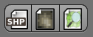
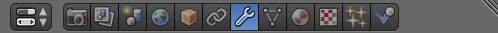
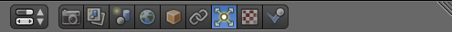
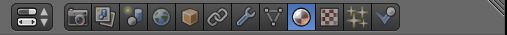

[](https://creativecommons.org/licenses/by/4.0/)

# Geospatial modeling and fabrication

<p align="center"></p>

This course is an introduction to digital design for landscape architects.
In this course you will develop a creative digital design process
seamlessly integrating research and design
using geographic information systems (GIS),
3D modeling and rendering, and
visual programming.
You will learn how to use geospatial data
to model and analyze landscapes
and visual programming to
parametrically model and transform new landforms.
You will learn how to model plants - from trees to grasses - in 3D,
automatically distribute them across your digital landscape,
and render photorealistic scenes.
Through a series of 3D modeling projects you will
design the restoration of a highly eroded landscape with a deep gully.
Each week you will spend a day in a workshop
learning new methods
and a day developing your projects.
You will work in small teams and present an exhibition of your
models and renderings at the end of the course.

**Assignments** [Projects](projects.md)

**Resources** [Geospatial data sources](geospatial-data-sources.md)

**Software** | [GRASS GIS](https://grass.osgeo.org) |
[Rhino](https://www.rhino3d.com/) |
[Blender](https://www.blender.org/)

**Add-ons** |
[r.geomorphon](https://grass.osgeo.org/grass72/manuals/addons/r.geomorphon.html) |
[r.skyview](https://grass.osgeo.org/grass72/manuals/addons/r.skyview.html) |
[r.lake.series](https://grass.osgeo.org/grass72/manuals/addons/r.lake.series.html) |
[r.stream](https://grasswiki.osgeo.org/wiki/R.stream.*_modules) |
[r.sun.daily](https://grass.osgeo.org/grass72/manuals/addons/r.sun.daily.html) |
[r.sun.hourly](https://grass.osgeo.org/grass72/manuals/addons/r.sun.hourly.html) |
[RhinoTerrain](http://www.rhinoterrain.com/en/home.html) |
[Neon](http://v5.rhino3d.com/group/neon) |
[BlenderGIS](https://github.com/domlysz/BlenderGIS) |
[TheGrove3D](https://www.thegrove3d.com/)

**Tutorials** |
[Intro to GRASS GIS](http://ncsu-geoforall-lab.github.io/grass-intro-workshop/) |
[lecture.lsu.edu/](https://lecture.lsu.edu/) |
[BlenderGIS wiki](https://github.com/domlysz/BlenderGIS/wiki)

---
## Contents
1. [**Terrain modeling**](terrain-modeling.md)
    1. [Elevation data sources](terrain-modeling.md#elevation-data-sources)
    2. [Lidar](terrain-modeling.md#lidar)
    3. [Topographic analysis](terrain-modeling.md#topographic-analysis)
    4. [3D terrain visualization](terrain-modeling.md#3d-terrain-visualization)
    4. [3D terrain modeling](terrain-modeling.md#3d-terrain-modeling)
2. [**Hydrological modeling**](hydrological-modeling.md)
    1. [Watershed modeling and analysis](hydrological-modeling.md#watershed-modeling-and-analysis)
    2. [Stream modeling and analysis](hydrological-modeling.md#stream-modeling-and-analysis)
    3. [Flood modeling](hydrological-modeling.md#flood-modeling)
    4. [Flood animation](hydrological-modeling.md#flood-animation)
3. [**Hydrological simulation**](hydrological-simulation.md)
    1. [Shallow water flow](hydrological-simulation.md#shallow-water-flow)
    2. [Shallow water flow with landcover](hydrological-simulation.md#shallow-water-flow-with-landcover)
    3. [Erosion-deposition](hydrological-simulation.md#erosion-deposition)
    4. [Sediment flow](hydrological-simulation.md#sediment-flow)
    5. [Water flow animation](hydrological-simulation.md#water-flow-animation)
4. [**Parametric modeling**](#parametric-modeling)
    1. [Surface modeling](#surface-modeling)
    2. [Parametric surface modeling](#parametric-surface-modeling)
    3. [Attractors](#attractors)
5. [**3D ecosystems**](#3d-ecosystems)
    1. [Image classification](#image-classification)
    2. [3D terrain](#3d-terrain)
    3. [3D planting](#3d-planting)
    4. [Particle systems](#particle-systems)
    5. [Rendering](#rendering)
    6. [Physics](#physics)
---


## 3D ecosystems

### Image classification
**Importing orthophotography**
Start GRASS GIS in the `nc_spm_evolution` location
and create a new `imagery` mapset.
Set your region to our study area with 1 meter resolution
using the module
[g.region](https://grass.osgeo.org/grass72/manuals/g.region.html).
Import the National Agriculture Imagery Program (NAIP)
orthophotograph from 2014 for the study area with
[r.import](https://grass.osgeo.org/grass72/manuals/r.import.html).
Set the extent to the region.
Then composite the red, green, and blue channels
to generate a natural color map using
[r.composite](https://grass.osgeo.org/grass72/manuals/r.composite.html).
```
g.region region=region res=1
r.import input=D:\fort_bragg_data\m_3507963_ne_17_1_20140517.tif output=imagery_2014 title=imagery_2014 resample=nearest resolution=value resolution_value=1 extent=region
r.composite red=imagery_2014.1 green=imagery_2014.2 blue=imagery_2014.3 output=imagery_2014
```

**Unsupervised image classification**
Start GRASS GIS in the `nc_spm_evolution` location
and open the `imagery` mapset.
Set your region to our study area with 1 meter resolution
using the module
[g.region](https://grass.osgeo.org/grass72/manuals/g.region.html).
Create a imagery group using the red, green, and blue channels
of the 2014 NAIP orthophotograph with
[i.group](https://grass.osgeo.org/grass72/manuals/i.group.html).
Generate a spectral signatures for landcover based on clustering using
[i.cluster](https://grass.osgeo.org/grass72/manuals/i.cluster.html).
In the settings tab set the initial number of classes to 2,
i.e. bare ground vs vegetation.
Use the spectral signature to classify the landcover
based on maximum-likelihood discriminant analysis
with the module
[i.maxlik](https://grass.osgeo.org/grass72/manuals/i.maxlik.html).

```
g.region region=region res=1
i.group group=imagery subgroup=imagery_2014 input=imagery_2014.1,imagery_2014.2,imagery_2014.3
i.cluster group=imagery subgroup=imagery_2014 signaturefile=signature_imagery_2014 classes=2
i.maxlik group=imagery subgroup=imagery_2014 signaturefile=signature_imagery_2014 output=classification_imagery_2014
```

Use the module [r.recode](https://grass.osgeo.org/grass72/manuals/r.recode.html)
to recode the classified imagery using the rules file
`imagery_to_landcover.txt` stored in the `nc_spm_evolution` location.
This will reassign class 1 to the National Landcover Dataset's (NLCD)
class 71, i.e. *Grassland/Herbaceuous*.
And it will reassign class 2 to NCLD's class 31, i.e. *Barren Land*.
You should have created a map of vegetation
based on classified lidar data called `vegetation_2012`
in the [Lidar](#lidar) tutorial.
Run `g.mapset` and check the `lidar` mapset to access that data.
If you did not create `vegetation_2012`
you can use the copy in the `PERMANENT` mapset.
Use map algebra with
[r.mapcalc](https://grass.osgeo.org/grass72/manuals/r.mapcalc.html)
to combine the lidar based trees and shrub
(reassigned as NLCD class 43, i.e. Mixed Forest)
with the imagery based grass and barren land.
Then assign the NLCD color table from the
`color_landcover.txt` rules file with
[r.color](https://grass.osgeo.org/grass72/manuals/r.colors.html).
Finally assign text labels to the class numbers
based on the rules file `landcover_categories.txt` using
[r.category](https://grass.osgeo.org/grass72/manuals/r.category.html)
```
r.recode input=classification_imagery_2014 output=recode_imagery_2014 rules=imagery_to_landcover.txt
r.mapcalc "landcover = if(isnull(vegetation_2012), recode_imagery_2014, 43)"
r.colors map=landcover rules=color_landcover.txt
r.category map=landcover separator=pipe rules=landcover_categories.txt
```

### 3D Terrain

**Export geospatial data from GRASS GIS**
Start GRASS GIS in the `nc_spm_evolution` location
and open the `PERMANENT` mapset.
Set a new region for a smaller study area
using the module
[g.region](https://grass.osgeo.org/grass72/manuals/g.region.html).
Export the 2016 digital elevation model as a GeoTIFF using
[r.out.gdal](https://grass.osgeo.org/grass72/manuals/r.out.gdal.html).
Then change the mapset to `imagery` using
[g.mapset](https://grass.osgeo.org/grass72/manuals/g.mapset.html).
Use map algebra with
[r.mapcalc](https://grass.osgeo.org/grass72/manuals/r.mapcalc.html)
to create separate grass and mixed forest maps
and then export these landcover maps as GeoTIFFs using
[r.out.gdal](https://grass.osgeo.org/grass72/manuals/r.out.gdal.html).
```
g.region n=150862 s=150712 w=597290 e=597440 save=subregion res=1
r.out.gdal input=elevation_2016@PERMANENT output=subregion.tif format=GTiff
g.mapset mapset=imagery
r.mapcalc "grass = if(landcover@PERMANENT == 71 , 1, 0)"
r.mapcalc "mixed_forest = if(landcover@PERMANENT == 43 , 1, 0)"
r.colors map=grass color=grey
r.colors map=mixed_forest color=grey
r.out.gdal input=grass@imagery output=grass.tif format=GTiff
r.out.gdal input=mixed_forest@imagery output=mixed_forest.tif format=GTiff
```

Run g.region with the `p` flag to print the boundaries.
Copy the `south` and `west` boundary values.
You will use these to set your origin of your scene in Blender.
```
g.region -p  
```
The output will be:
```
projection: 99 (NAD83(HARN) / North Carolina)
zone:       0
datum:      nad83harn
ellipsoid:  grs80
north:      150862
south:      150712
west:       597290
east:       597440
nsres:      1
ewres:      1
rows:       150
cols:       150
cells:      22500
```

**Importing geospatial data into Blender**
Download the
[zip archive](https://github.com/domlysz/BlenderGIS/archive/master.zip)
for the
[BlenderGIS add-on](https://github.com/domlysz/BlenderGIS).
See its [wiki](https://github.com/domlysz/BlenderGIS/wiki)
for detailed instructions about installing and using the add-on.

Launch Blender.
Set the renderer to `Cycles Render`.
In the `File` menu open `User Preferences` (Ctrl + Alt + U).
In the `Add-ons` tab click `Install from File...`
and select `BlenderGIS-master.zip`.
Check and then expand `3D View: BlenderGIS`.
Set the BlenderGIS' `Spatial Reference Systems`
to North Carolina State Plane Meters
by clicking `Add` and then setting the EPSG code with
`Definition: 3358`,
`Description: NAD83(HARN) / North Carolina`,
and checking `Save to addon preferences`.
Then click `Ok`.
Select the new `NAD83(HARN) / North Carolina` spatial reference system.
Click `Save User Settings`
and close the User Preferences dialog.

*Nota bene:* you can search for EPSG codes on the web at either
[epsg.io](epsg.io)
or [http://spatialreference.org/](http://spatialreference.org/).
Try searching either site for `North Carolina` then select
the result with the North American Datum of 1983 (NAD83)
and North Carolina State Plane
(High Accuracy Reference Network) with meters as the unit.
The EPSG code will be `3358`.

In Blender set the 3D viewport to `Top Ortho`.
First set `Ortho` by pressing `5` on the numeric keypad
then set `Top` by pressing `7` on the numeric keypad.
*Nota bene:* [numeric keypad hotkeys](https://en.wikibooks.org/wiki/Blender_3D:_HotKeys/3D_View/Object_Mode)

Delete the default cube.

Open the `GIS` tab added by Blender GIS.
First set your spatial reference system
Under `Geoscene` click the

`Switch scene crs` button
and select `NAD83 / North Carolina`
from the dropdown menu and press `Ok`.
Then set the `scene origin coordinates` to `Proj` and
set `crs x: 597290` and `crs y: 150712`
to match the west and south boundaries determined in GRASS GIS.

Import `subregion.tif` into Blender using
`File > Import > Georeferenced raster`
or the

`Import georeferenced raster with world file` button in the GIS tab.
Select `elevation_2016.tif`. then in the `Import georaster` panel
set `Mode: As DEM`,
set `Subdivision: Mesh`
and finally click `Import georaster`.
See the BlenderGIS
[wiki](https://github.com/domlysz/BlenderGIS/wiki/Import-georef-raster).
for more details about importing georeferenced rasters.

To vertically exaggerate the digital elevation model
select `subregion` in the Outliner,
and open the

`Modifiers` panel.
This will show the parameters for the
[displace](https://docs.blender.org/manual/en/dev/modeling/modifiers/deform/displace.html)
modifier used to generate a mesh from the raster values.
Set `Strength: 2.0`
to vertically exaggerate by a factor of 2.
Click `Apply` to make this displace modifier permanent.

Create a base for the terrain.
First either copy and paste elevation_2016
or import it again.
Select this new copy.
Rename it `Base`.
Enter edit mode with `tab`.
Extrude Region with `e `
then type `-25` to extrude -50 meter vertically.
Scale with `s`, type `z` to constrain to the z-axis,
and type `0` to flatten the base.
Press `tab` to return to object mode.

Use a sun to light the scene.
Select `Lamp` in the Outliner
and open the

`Data` panel.
Set `Lamp` to `Sun`.
Move the sun 1000 units vertically.

Save your scene as `nspm_evolution.blend` (Shift + Ctrl + S).

### 3D planting
*Under development...*


### Particle systems
**Ground texture**
Select our terrain mesh `subregion` in the Outliner.
In the 
`Material` panel
open the `Cycles Material Vault`,
click on `Category Type`,
select `Ground`,
browse to select `Ground01`,
and click `Assign Material`.
Then in the `Surface` tab of the `Material` panel
set `Scale: 10`.

Save your scene (Ctrl + S).

**Forest particle system**
First on a new layer append
`plant_library\c_eastern_white_pine_a.blend\Group\eastern_white_pine`.

In the 
`Textures` panel
create a `Mixed forest` texture with
`mixed_forest.tif`.

Open the

`Particles` panel.
Click `New` to create a new particle system.
Rename as `Forest`.
In the `Emission` tab
set `Type` to `Emitter`,
`Number` to `500`,
`Start` to `-1`, and
`End` to `-1`
(so that all particle will appear in the first time step).

In the `Texture` tab of the `Particles` panel
add the `Mixed forest` texture.

Switch to the `Texture` panel.
Select the `Mixed forest` texture.
In the `Influence` tab uncheck
`Time` and check `Influence: 1.0`

Back in the `Particles` panels
in the `Rendered` tab
select `Group`, click `Dupli Group` and browse to select the
`eastern_white_pine` group.
Set `Size: 0.1` amd `Random Size: 0.05`

Save your scene (Ctrl + S).

**Grass particle system**
In a new layer append
`D:\GrassEssentials\Grass Essentials - Grass Models v1.2\Grass\Kentucky Bluegrass\Grass_Kentucky Bluegrass.blend\Group\APPEND - Grass_Kentucky_Bluegrass - Particles Setup`.

In another new layer append
`D:\GrassEssentials\Grass Essentials - Grass Models v1.2\Grass\Meadow Fescues\Grass_Meadow Fescues.blend\Group\APPEND - Grass_Meadow Fescues - Particles Setup`.

In the 
`Textures` panel
create a `Grass` texture with
`grass.tif`.

Open the

`Particles` panel.
Click `New` to create a new particle system.
Rename as `Bluegrass`.
Under `Settings` use the

`Browse particle settings to be linked` dropdown menu
to select the appended Kentucky Bluegrass particle system.
In the `Emissions` tab of the `Particles` panel
set `Number: 100000`
and `Hair Length: 50`
In the `Texture` tab of the `Particles` panel
add the `Grass` texture.
Switch to the `Texture` panel.
Select the `Grass` texture.
In the `Influence` tab uncheck
`Time` and check `Influence: 1.0`

Repeat for the Meadow Fescues particle system.
Use a lower number of emissions (e.g. 10000).

Save your scene (Ctrl + S).

### Rendering
Select the terrain mesh `subregion` in the Outliner.
Use `Numpad .` to focus your viewport on your selection.

Align your camera with the viewport using
`Ctrl + Alt + Numpad 0`.

Use `Numpad 0` to toggle between camera view and the viewport view.

Press `F12` to Render.
Once the rendering finishes
click `Image > Save as`.

*Under development...*

### Physics
*Under development...*

## License
Open educational materials licensed CC BY-SA 4.0 by Brendan Harmon :monkey_face:. The license does not apply to logos, fonts, linked material, quotations, or reprinted images by other authors, which may have different licenses. The fonts used in this repository are licensed under the SIL Open Font License by their authors. The syllabus is based on a latex template by Kieran Healy hosted at https://github.com/kjhealy/latex-custom-kjh.
