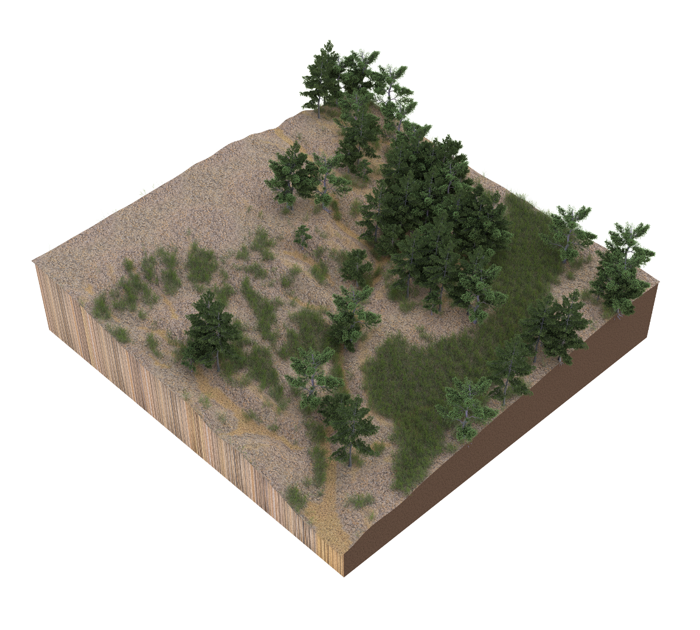

# Geospatial Modeling

This course is an introduction to geospatial modeling for landscape architects.
In this course you will develop a creative digital design process
seamlessly integrating research and design
using geographic information systems (GIS),
3D modeling and rendering, and
visual programming.
You will learn how to use geospatial data
to model and analyze landscapes
and visual programming to
parametrically model and transform new landforms.
You will learn how to model plants - from trees to grasses - in 3D,
automatically distribute them across your digital landscape,
and render photorealistic scenes.
Through a series of 3D modeling projects you will
design the restoration of a highly eroded landscape with a deep gully.

---

**Assignments** | [Projects](projects.md) | [Readings](readings.md)

**Resources** | [Geospatial data sources](geospatial-data-sources.md)

**Software** | [GRASS GIS](https://grass.osgeo.org) |
[Rhino](https://www.rhino3d.com/) |
[Blender](https://www.blender.org/)

**Add-ons** |
[r.geomorphon](https://grass.osgeo.org/grass72/manuals/addons/r.geomorphon.html) |
[r.skyview](https://grass.osgeo.org/grass72/manuals/addons/r.skyview.html) |
[r.lake.series](https://grass.osgeo.org/grass72/manuals/addons/r.lake.series.html) |
[r.stream](https://grasswiki.osgeo.org/wiki/R.stream.*_modules) |
[r.sun.daily](https://grass.osgeo.org/grass72/manuals/addons/r.sun.daily.html) |
[r.sun.hourly](https://grass.osgeo.org/grass72/manuals/addons/r.sun.hourly.html) |
[r.evolution](https://github.com/baharmon/landscape_evolution) |
[RhinoTerrain](http://www.rhinoterrain.com/en/home.html) |
[Neon](http://v5.rhino3d.com/group/neon) |
[BlenderGIS](https://github.com/domlysz/BlenderGIS)

**Libraries** | [Xfrog](http://xfrog.com/) | [TheGrove3D](https://www.thegrove3d.com/)

**Tutorials** |
[lecture.lsu.edu/](https://lecture.lsu.edu/) |
[Intro to GRASS GIS](http://ncsu-geoforall-lab.github.io/grass-intro-workshop/) |
[BlenderGIS wiki](https://github.com/domlysz/BlenderGIS/wiki)

**Gallery** | [Student work 2017](gallery.md#student-work-2017)

---
## Contents

1. **Geospatial modeling**
    1. [Airborne lidar](airborne-lidar.md)
    2. [Terrestrial lidar](terrestrial-lidar.md)
    3. [Unmanned aerial systems](unmanned-aerial-systems.md)
    4. [Photospheres](photospheres.md)

    **Project** | [Gully monitoring](projects.md#gully-monitoring)

    5. [Terrain modeling](terrain-modeling.md)
    6. [Digital fabrication](digital-fabrication.md)
    7. [Hydrological modeling](hydrological-modeling.md)
    8. [Erosion modeling](erosion-modeling.md)
    9. [Landscape evolution](landscape-evolution.md)

    **Project** | [Physical simulation](projects.md#physical-simulation)

2. **Generative design**
    1. [The alphabet and algorithm](the-alphabet-and-algorithm.md)
    2. [Map algebra](map-algebra.md)
    3. [Visual programming](visual-programming.md)
    4. [Parametric landforms](parametric-landforms.md)
    5. [Generative processes](generative-processes.md)
    6. [Attractors](attractors.md)

    **Project** | [Families of form](projects.md#families-of-form)

3. **Ecosystem modeling**
    1. [3D plants](3d-plants.md)
    2. [Particle systems](particle-systems.md)

    **Project** | [The great piece of turf](projects.md#the-great-piece-of-turf)

    3. [Image classification](image-classification.md)
    4. [Landform classification](landform-classification.md)
    5. [Landscape modeling](landscape-modeling.md)
    6. [Landscape rendering](landscape-rendering.md)
    7. [Bioengineering](bioengineering.md)
    8. [Freeform modeling](freeform-modeling.md)
    9. [Virtual reality](virtual-reality.md)

    **Project** | [Gully restoration](projects.md#gully-restoration)

---

## Course data
Open access data for this course can be downloaded from:
* [GRASS GIS Mapset](https://github.com/baharmon/landscape_evolution_dataset)
* [Open Science Framework Repository](osf.io/f6egw)

---

## Network drives
Students enrolled in the Louisiana State University course LA 7032 Media III
should submit their work via the course network drive.
* Windows: `\\desn-knox.lsu.edu\Landscape-Classes`
* Mac: `smb://desn-knox.lsu.edu/Landscape-Classes`

Additional resources are available on the lab network drive.
* Windows: `\\desn-knox.lsu.edu\CADGIS_SHARE`
* Mac: `smb://desn-knox.lsu.edu/CADGIS_SHARE`

---

## License
Open educational materials licensed CC BY-SA 4.0
by Brendan Harmon :monkey_face:.
The license does not apply to logos, fonts, linked material, data, quotations,
or reprinted images by other authors, which may have different licenses.
The fonts used in this repository are licensed under the SIL Open Font License
by their authors. The syllabus is based on a latex template by Kieran Healy
hosted at https://github.com/kjhealy/latex-custom-kjh.
