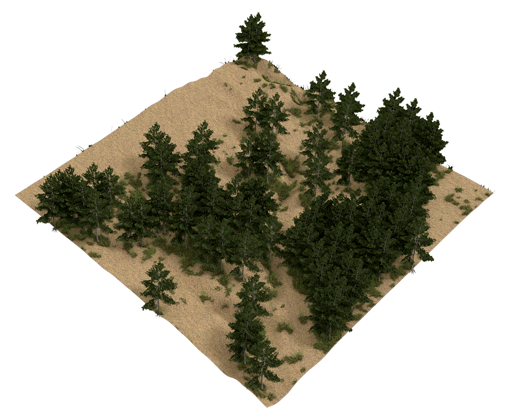

# Geospatial modeling and fabrication

This course is an introduction to digital design for landscape architects.
In this course you will develop a creative digital design process
seamlessly integrating research and design
using geographic information systems (GIS),
3D modeling and rendering, and
visual programming.
You will learn how to use geospatial data
to model and analyze landscapes
and visual programming to
parametrically model and transform new landforms.
You will learn how to model plants - from trees to grasses - in 3D,
automatically distribute them across your digital landscape,
and render photorealistic scenes.
Through a series of 3D modeling projects you will
design the restoration of a highly eroded landscape with a deep gully.
Each week you will spend a day in a workshop
learning new methods
and a day developing your projects.
You will work in small teams and present an exhibition of your
models and renderings at the end of the course.

**Assignments** | [Projects](projects.md)

**Resources** | [Geospatial data sources](geospatial-data-sources.md)

**Software** | [GRASS GIS](https://grass.osgeo.org) |
[Rhino](https://www.rhino3d.com/) |
[Blender](https://www.blender.org/)

**Add-ons** |
[r.geomorphon](https://grass.osgeo.org/grass72/manuals/addons/r.geomorphon.html) |
[r.skyview](https://grass.osgeo.org/grass72/manuals/addons/r.skyview.html) |
[r.lake.series](https://grass.osgeo.org/grass72/manuals/addons/r.lake.series.html) |
[r.stream](https://grasswiki.osgeo.org/wiki/R.stream.*_modules) |
[r.sun.daily](https://grass.osgeo.org/grass72/manuals/addons/r.sun.daily.html) |
[r.sun.hourly](https://grass.osgeo.org/grass72/manuals/addons/r.sun.hourly.html) |
[RhinoTerrain](http://www.rhinoterrain.com/en/home.html) |
[Neon](http://v5.rhino3d.com/group/neon) |
[BlenderGIS](https://github.com/domlysz/BlenderGIS) |
[TheGrove3D](https://www.thegrove3d.com/)

**Libraries** | [Xfrog](http://xfrog.com/)

**Tutorials** |
[Intro to GRASS GIS](http://ncsu-geoforall-lab.github.io/grass-intro-workshop/) |
[lecture.lsu.edu/](https://lecture.lsu.edu/) |
[BlenderGIS wiki](https://github.com/domlysz/BlenderGIS/wiki)

**Gallery** | [Student work 2017](gallery.md#student-work-2017)

---
## Contents
1. [**Terrain modeling**](terrain-modeling.md)
    1. [Elevation data sources](terrain-modeling.md#elevation-data-sources)
    2. [Lidar](terrain-modeling.md#lidar)
    3. [Topographic analysis](terrain-modeling.md#topographic-analysis)
    4. [3D terrain visualization](terrain-modeling.md#3d-terrain-visualization)
    4. [3D terrain modeling](terrain-modeling.md#3d-terrain-modeling)
2. [**Hydrological modeling**](hydrological-modeling.md)
    1. [Watershed modeling and analysis](hydrological-modeling.md#watershed-modeling-and-analysis)
    2. [Stream modeling and analysis](hydrological-modeling.md#stream-modeling-and-analysis)
    3. [Flood modeling](hydrological-modeling.md#flood-modeling)
    4. [Flood animation](hydrological-modeling.md#flood-animation)
3. [**Hydrological simulation**](hydrological-simulation.md)
    1. [Shallow water flow](hydrological-simulation.md#shallow-water-flow)
    2. [Shallow water flow with landcover](hydrological-simulation.md#shallow-water-flow-with-landcover)
    3. [Erosion-deposition](hydrological-simulation.md#erosion-deposition)
    4. [Sediment flow](hydrological-simulation.md#sediment-flow)
    5. [Water flow animation](hydrological-simulation.md#water-flow-animation)
4. [**Parametric modeling**](parametric-modeling.md)
    1. [Surface modeling](parametric-modeling.md#surface-modeling)
    2. [Parametric surface modeling](parametric-modeling.md#parametric-surface-modeling)
    3. [Attractors](parametric-modeling.md#attractors)
5. [**3D ecosystems**](3d-ecosystems.md)
    1. [Image classification](3d-ecosystems.md#image-classification)
    2. [3D terrain](3d-ecosystems.md#3d-terrain)
    3. [3D planting](3d-ecosystems.md#3d-planting)
    4. [Particle systems](3d-ecosystems.md#particle-systems)
    5. [Rendering](3d-ecosystems.md#rendering)
    6. [Physics](3d-ecosystems.md#physics)
---

## License
Open educational materials licensed CC BY-SA 4.0 by Brendan Harmon :monkey_face:. The license does not apply to logos, fonts, linked material, quotations, or reprinted images by other authors, which may have different licenses. The fonts used in this repository are licensed under the SIL Open Font License by their authors. The syllabus is based on a latex template by Kieran Healy hosted at https://github.com/kjhealy/latex-custom-kjh.
