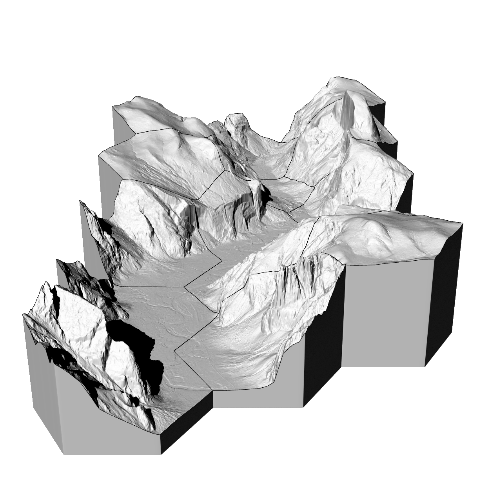

# Geospatial modeling and fabrication
Online, open educational materials for the landscape architecture course Geospatial Modeling and Fabrication.

# License
CC BY-SA 4.0 by Brendan Harmon. The license does not apply to logos, fonts, linked material, quotations, or reprinted images by other authors, which may have different licenses. The fonts used in this repository are licensed under the SIL Open Font License by their authors. The syllabus is based on a latex template by Kieran Healy hosted at https://github.com/kjhealy/latex-custom-kjh.
