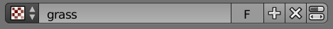

# Contents
1. [**Particle systems**](#particle-systems)
    1. [Forest particle system](#forest-particle_system)
    2. [Grass particle system](#grass-particle_system)

# Particle systems

## Forest particle system
First on a new layer append
`plant_library\c_eastern_white_pine_a.blend\Group\eastern_white_pine`.

In the 
`Textures` panel
create a `Mixed forest` texture with
`mixed_forest.tif`.

Open the

`Particles` panel.
Click `New` to create a new particle system.
Rename as `Forest`.
In the `Emission` tab
set `Type` to `Emitter`,
`Number` to `500`,
`Start` to `-1`, and
`End` to `-1`
(so that all particle will appear in the first time step).

In the `Texture` tab of the `Particles` panel
add the `Mixed forest` texture.

Switch to the `Texture` panel.
Select the `Mixed forest` texture.
In the `Influence` tab uncheck
`Time` and check `Influence: 1.0`

Back in the `Particles` panels
in the `Rendered` tab
select `Group`, click `Dupli Group` and browse to select the
`eastern_white_pine` group.
Set `Size: 0.1` amd `Random Size: 0.05`

Save your scene (Ctrl + S).

# Grass particle system
In a new layer append
`D:\GrassEssentials\Grass Essentials - Grass Models v1.2\Grass\Kentucky Bluegrass\Grass_Kentucky Bluegrass.blend\Group\APPEND - Grass_Kentucky_Bluegrass - Particles Setup`.

In another new layer append
`D:\GrassEssentials\Grass Essentials - Grass Models v1.2\Grass\Meadow Fescues\Grass_Meadow Fescues.blend\Group\APPEND - Grass_Meadow Fescues - Particles Setup`.

Open the

`Particles` panel.
Click `New` to create a new particle system.
Rename as `Bluegrass`.
Under `Settings` use the

`Browse particle settings to be linked` dropdown menu
to select the appended Kentucky Bluegrass particle system.
In the `Emissions` tab of the `Particles` panel
set `Number: 100000`
and `Hair Length: 50`
In the `Texture` tab of the `Particles` panel
add a new texture called `grass`.
Use the `Show texture in texture tab` button

to open the `Texture` panel.
In the `Texture` panel set the image texture to `grass.tif`.
In the `Influence` tab uncheck
`Time` and check `Influence: 1.0`

Repeat for the Meadow Fescues particle system.
Use a lower number of emissions (e.g. 10000).

Save your scene (Ctrl + S).
