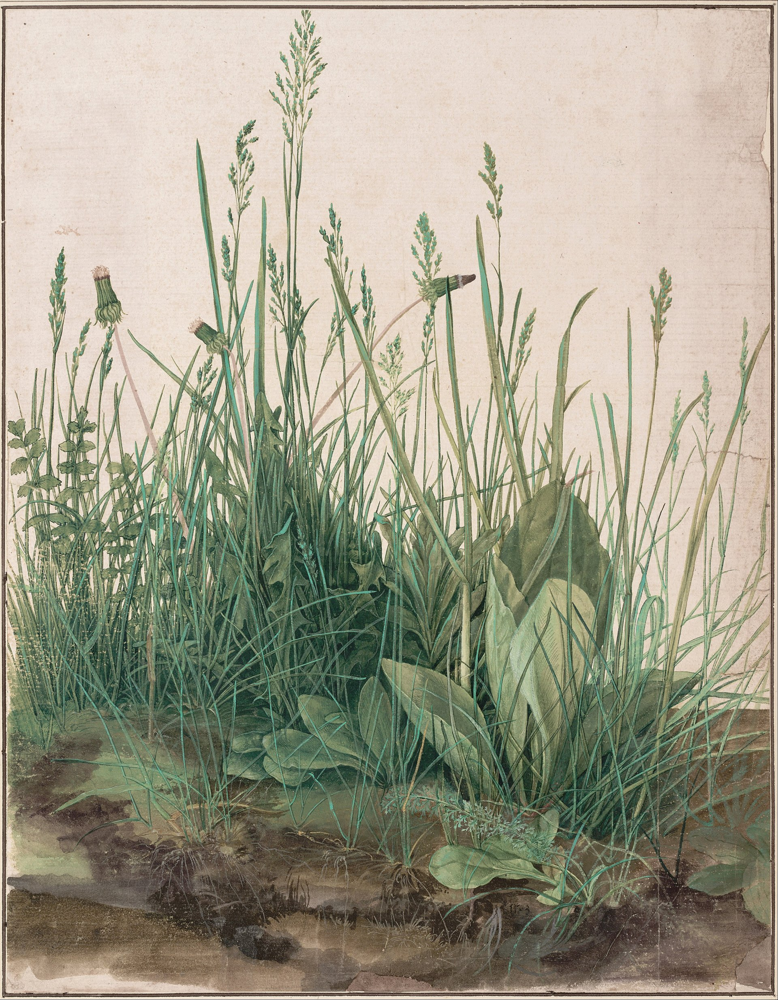

# Projects

The study landscape is a highly eroded watershed
feeding into Patterson Branch Creek in Fort Bragg, North Carolina.
This geomorphologically active watershed has deep gullies and
extensive areas of bare soils.
The creeks, streams, and rivers in this region are critical habitat
for endangered species of mussels.
Mussels, however, require stable stream habitat
and these actively eroding watersheds with sandy-loam soils
cause high sediment bed loads in streams and shifting streambeds.
The aim of this project is to restore the degraded watershed
and reduce sediment transport  
in order to enhance downstream mussel habitat.

All work should be submitted via the course network drive
at `\\desn-knox.lsu.edu\Landscape-Classes` on Windows
or `smb://desn-knox.lsu.edu/Landscape-Classes` on Mac.

---

## Contents
1. [**Projects**](#projects)
    1. [Gully monitoring](#gully-monitoring)
    1. [Physical simulation](#physical-simulation)
    1. [Parametric bench](#parametric-bench)
    1. [Families of form](#families-of-form)
    1. [The great piece of turf](#the-great-piece-of-turf)
    1. [Gully restoration](#gully-restoration)

---

## Gully monitoring
We will visit Clark Creek to survey active gullies.
In addition to taking photographs and 360 degree photospheres,
We will conduct a terrestrial lidar survey.
Back in the lab you will generate a digital surface model (DSM)
from the lidar data.
* Photosphere
* Digital surface model from lidar

## Physical simulation
You will use the CNC router to machine a physical model
of a landscape out of high density urethane foam.
Use this model as a base to develop a physical simulation of sediment flow.
Record your physical simulation as a video.
* Physical model
* Video of physical simulation (*.mp4*)

## Parametric bench
With Rhino or Grasshopper
design a parametric bench and cut it into slices
for digital fabrication.
Build a laser-cut prototype.
* Rhino 3D model (*.3dm*)
* 3D rendering (*.png*)
* Laser-cut prototype

## Families of form
You will use map algebra and visual programming to generatively design
erosion control features to restore your degraded study landscape.
Through a series of algorithmically generated design interventions
and GIS-based simulations you will explore interactions between
topographic form and hydrologic processes.
Your goal is to catalyze topographic changes that will
restore the landscape to a dynamic equilibrium.  
You will produce digitally fabricated models of your designs
and augment these with projected water flow and sediment flux.
* Rhino 3D model (*.3dm*)
* Grasshopper data (*.gh*)
* 3D renderings(*.png*)
* CNC milled or 3D printed models

## The great piece of turf
You will create a 3D model and 3D rendering of
Albrecht Dürer's Great Piece of Turf.
Use particle systems to distribute 3D flowers, grasses,
and other ground cover across a block of soil.
* Blender file with a 3D model of the existing landscape (*.blend*)
* 3D rendering (*.png*)

Das große Rasenstück | The Great Piece of Turf, Albrecht Dürer, 1503.

## Gully restoration
You will map the existing vegetation and landforms
using automated classification algorithms.
Then you will design, model, and render in 3D
a bioswale to restore this degraded landscape.
You will produce 3D printed models of your designs
and augment these with projected water flow and sediment flux.
You will produce beautiful, photorealistic 3D renderings  
of the existing and restored landscape.

### 3D plant library
Develop a list of plants for the study landscape,
organize the plants by community,
find the species or proxies for them in the Xfrog libary,
and prepare 3D models for these species in Blender.
* Markdown spreadsheet with plant communities and species (*.md*)
* Blender library of 3D tree models (*.blend*)

### 3D model of the existing landscape
Build a terrain model in Blender.
Use image classification and geomorphons in GIS
to identify landcover types and landforms.
Then use particle systems to automatically populate
the 3D scene with 3D plants based on the landcover.
* Blender 3D model(*.blend*)
* 2+ 3D renderings (*.png*)

### 3D bioengineering design
Model a bioengineering intervention such as a tree stump,
gabion, or live willow sculpture.
* Physical prototype
* Rhino or Blender 3D model (*.3dm* or *.blend*)
* 3D rendering (*.png*)

### 3D model of the restored landscape
Develop a design to restore the study landscape
and build a 3D model in Blender of your design.
Include 3D trees, 3D grasses, soil textures
and 3D bioengineering interventions.
Test your design using water flow, erosion,
and landscape evolution simulations in GIS.
* Blender 3D model (*.blend*)
* 2+ 3D renderings (*.png*)
* GRASS GIS mapset
* 2D GRASS GIS renderings (*.png*)
* SketchFab or Blend4Web scene for VR (*.html* or *.json*)
