# Contents
1. [**Machining parametric surfaces**](#machining-parametric-surfaces)
    1. [Stock](#stock)
    2. [Parametric equations](#parametric-equations)
    3. [3D modeling](#3d-modeling)
    4. [Machining toolpaths](#machining-toolpaths)
      1. [World Coordinate System](#world-coordinate-system)
      2. [Work Zero](#work-zero)
      3. [Quarter inch parallel finish cut](#quarter-inch-parallel-finish-cut)
      4. [Eighth inch parallel finish cut](#eighth-inch-parallel-finish-cut)
      5. [Simulate toolpaths](#simulate-toolpaths)
      6. [Generate toolpaths](#generate-toolpaths)

---

# Machining parametric surfaces
Use computer numerical controlled (CNC) milling
to digitally fabricate a surface
generated by parametric equations in Rhino.
Use the Rhino file [machining-parametric-surfaces.3dm](../models/machining-parametric-surfaces.3dm)
as a reference.
Also see Niloufar Emami's
[guide to computer aided manufacturing](https://github.com/niloufaremami/CAD-CAM).

<p align="center">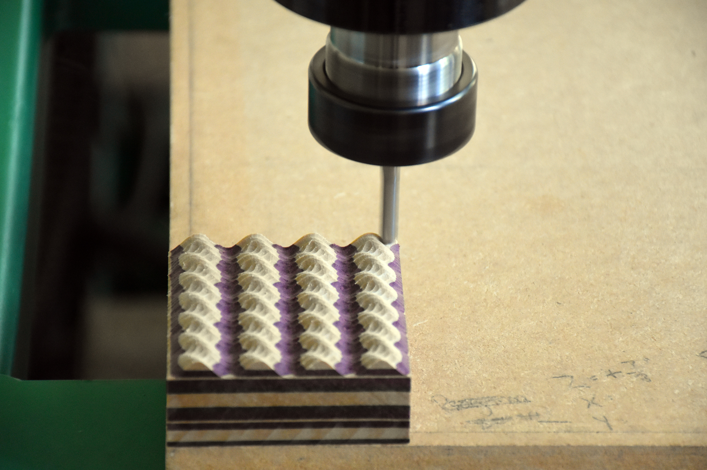</p>

---

## Stock
The stock for this CNC milling exercise
is a 2.75" x 2.75" x 1" sample of Richlite Black Diamond or Rainier.
Order [here](https://www.richlite.com/product/richlite-samples/).
High density urethane (HDU) foams including Renshape and Signfoam
can be substituted for this paper-composite material.

---

## Parametric equations
Install
the [RhinoMath](http://www.rhino3.de/_develop/__v3_plugins/math/) plugin.
Then run the
[MathSurface](http://www.rhino3.de/_develop/__v3_plugins/math/commands.shtml)
command with the following equations and parameters
to create a meandering mound (see Choma, [Morphing](http://www.morphingbook.com/), p.128-129).
```
MathSurface
minimum u: -PI/2
maximum u: PI/2
minimum v: 0
maximum v: PI
PointCount: 4
PointCount: 4
Function X(u,v): v
Function Y(u,v): sin(u)+cos(v)
Function Z(u,v): sin(v)*cos(u)
```

<p align="center">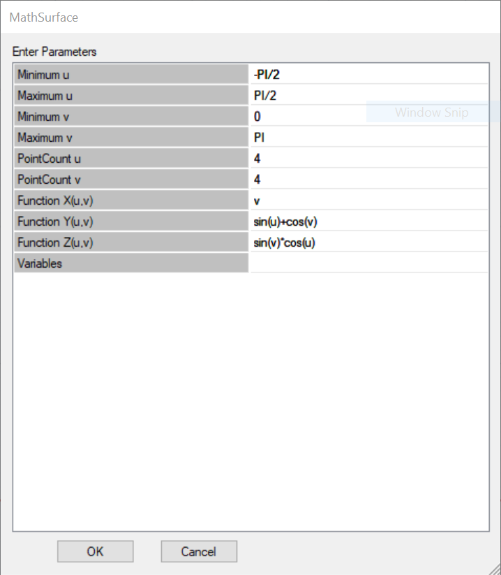</p>

---

## 3D modeling
Scale the parametric surface to the stock box
by reference length.
```
Command: Scale
```

Then scale the surface by a quarter.
```
Command: Scale
Origin point: 0,0,0
Scale factor: 0.25
```

Move the surface 0.3 inches below the top of the stock.
```
Command: _Move
Point to move from: 0,0,0
Point to move to: 0.70
```

Create a plane wider than the surface to use as a boundary for extrusion.
```
Command: Plane
First corner of plane: -1,-1,0
Other corner or length: 4,4,0
```

Extrude the surface to the boundary plane as a solid.
```
Command: _ExtrudeSrf
_Solid=_Yes
_ToBoundary
Extrusion distance <-1.6>
```

<p align="center">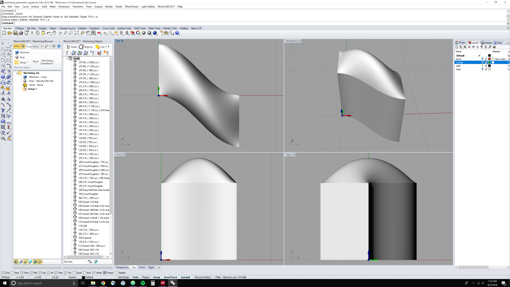</p>

Now create an array of solid polysurfaces either manually with object snaps
or using the Array command.
```
Command: Array
Number in X direction: 4
Number in Y direction: 8
Number in Z direction: 1
X spacing: 0.69
Y spacing: 0.4
```

<p align="center">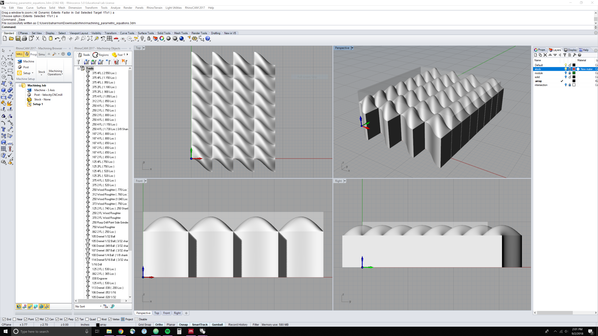</p>

Combine the array of polysurfaces into a single solid using a boolean union.
```
_BooleanUnion
```


Clip the parametric solid to the stock box using a boolean intersection.
```
_BooleanIntersection
```

<p align="center">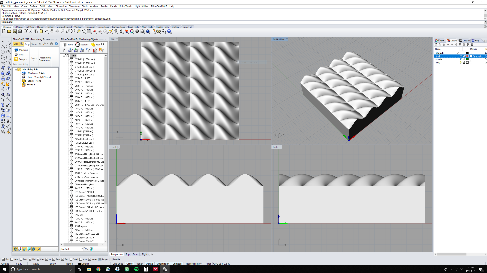</p>

Save your work.
```
_SaveAs
```

---

## Machining toolpaths
Launch the RhinoCAM plugin
```
RhinoCAM
```
In the RhinoCAM Machining Browser
select the `MILL` tab for milling operations.
Set the Machine to `3 Axis`.
Set the Post to `VelocityCNCmill`.
Set the Stock length to 2.75, width to 2.75, and height to 1.

<p align="center">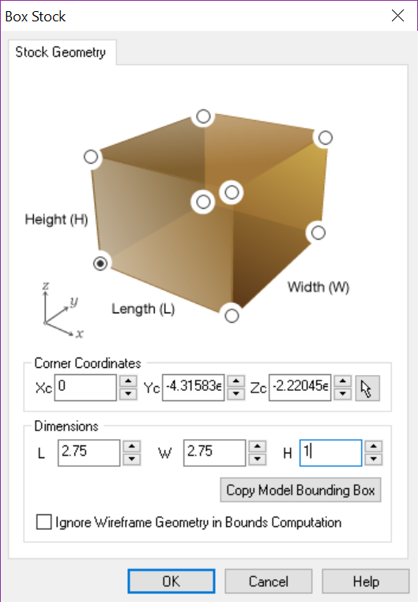</p>

---

### World Coordinate System
Set the World Coordinate System (WCS) to the box stock.
Select the SouthWest corner ontop of the stock.

---

### Work Zero
In the Machining Operations dropdown menu
select `Work Zero`.
Generate the work zero for the coordinate 0,0,1.

<p align="center">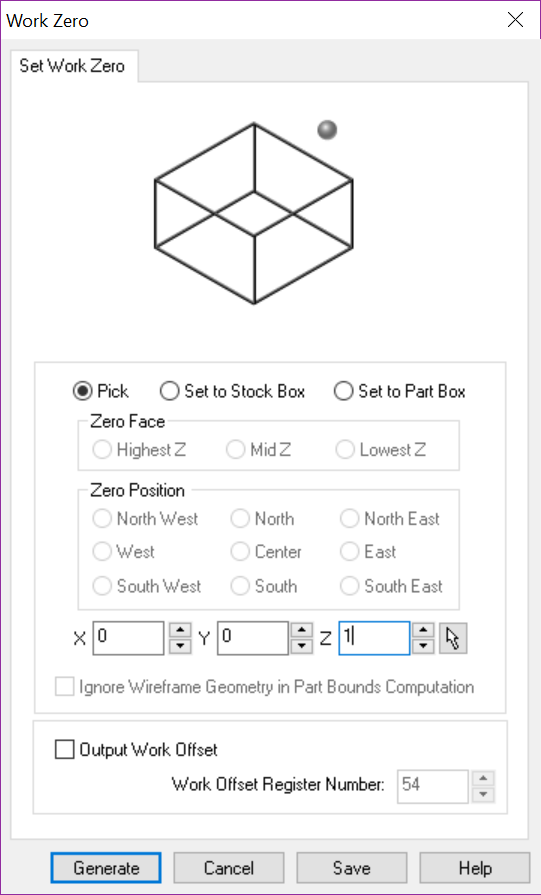</p>

---

### Quarter inch parallel finish cut
In the Machining Operations dropdown menu
select `3 Axis Adv > Parallel Finishing`.
In the Parallel Finishing dialog
select or create a `Ball Mill 0.25`.
```
Tool diameter: 0.25 in
Tool length: 2.5 in
Material: CARBIDE
Speed: 15000 RPM
Plunge: 50 in/min
Approach: 50 in/mm
Engage: 50 in/mm
Cut: 200 in/mm
Retract: 800 in/mm
Departure: 800 in/mm
```

<p align="center">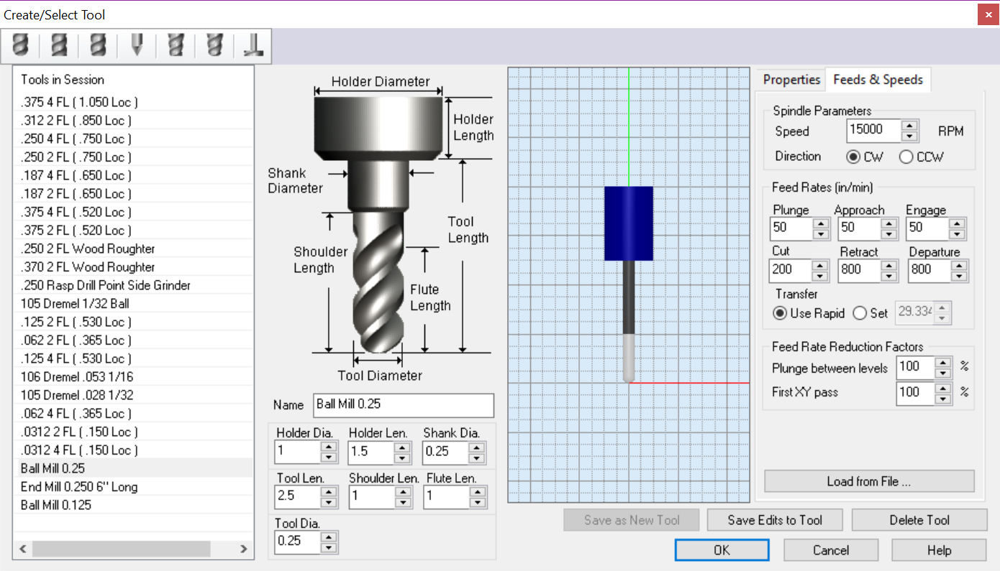</p>

In the Cut Parameters tab set Stepover Control to
`25`% Tool Diameter.
Press `Generate` to compute the
first toolpath.

<p align="center">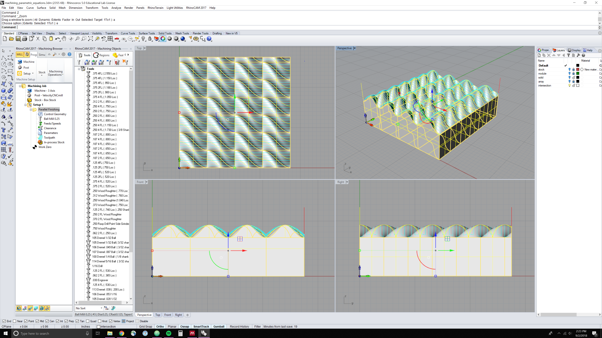</p>

---

### Eighth inch parallel finish cut
In the Machining Operations dropdown menu
select `3 Axis Adv > Parallel Finishing`.
In the Parallel Finishing dialog
select or create a `Ball Mill 0.125`.
In the Cut Parameters tab set
the Angle of Cuts to `90` degrees.
Press `Generate` to compute the
second toolpath.

<p align="center">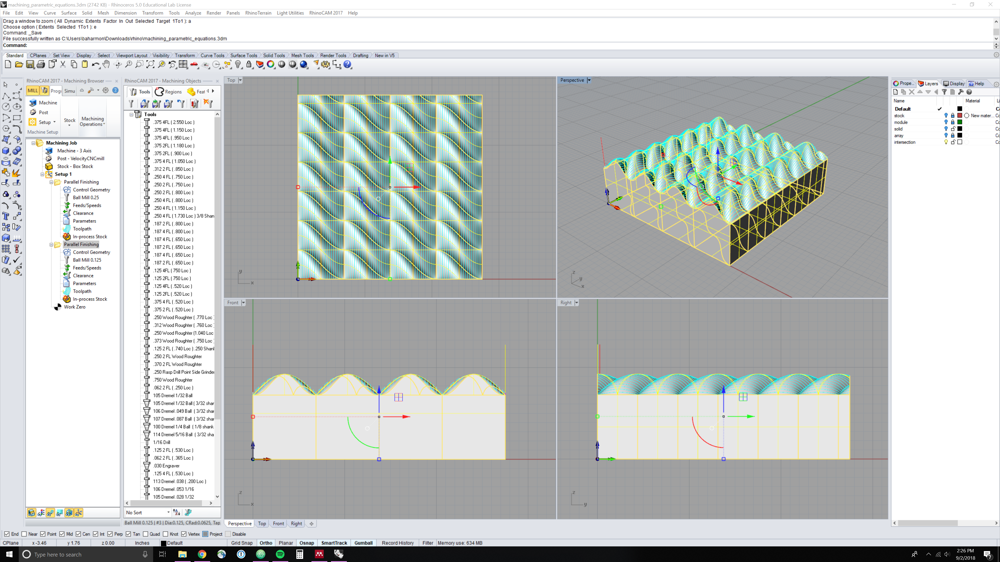</p>

---

### Simulate toolpaths
In the Simulate tab of the RhinoCAM Machining Browser
run a simulation to check each toolpath.

<p align="center">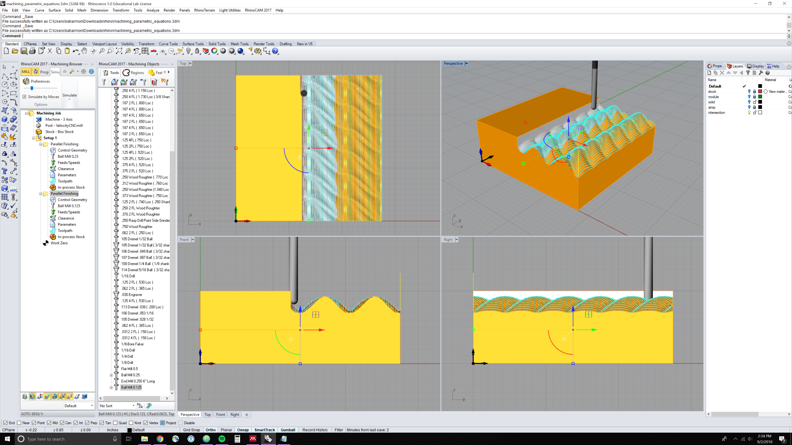</p>

---

### Generate toolpaths
Right click on each toolpath under the setup tree
and select `Post` to export numeric control *.nc* files with g-code.
Save the first toolpath as [parallel-finishing-quarter-inch.nc](../models/parallel-finishing-quarter-inch.nc)
and the second toolpath as [parallel-finishing-eighth-inch.nc](../models/parallel-finishing-eighth-inch.nc)

And of course save again!
`_Save`

<p align="center">
  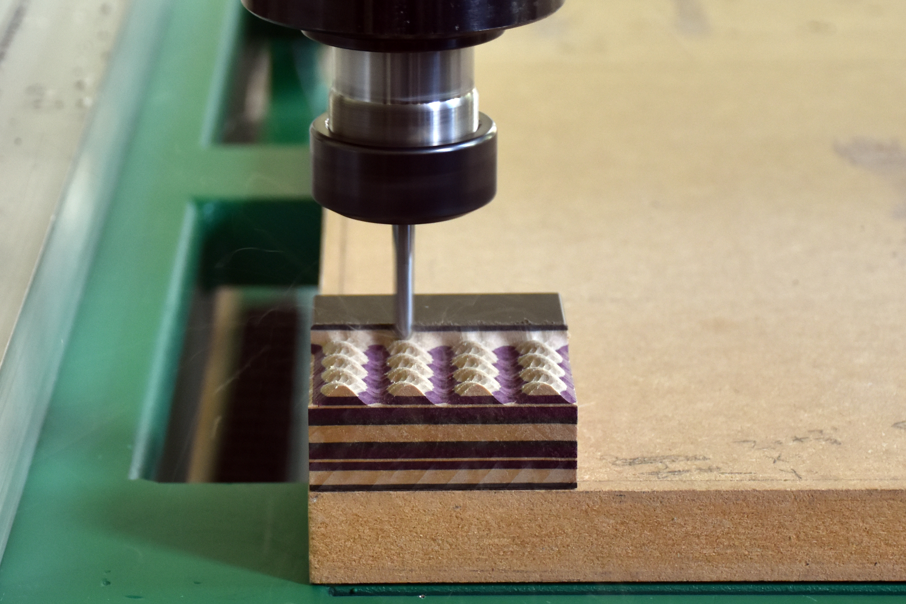
  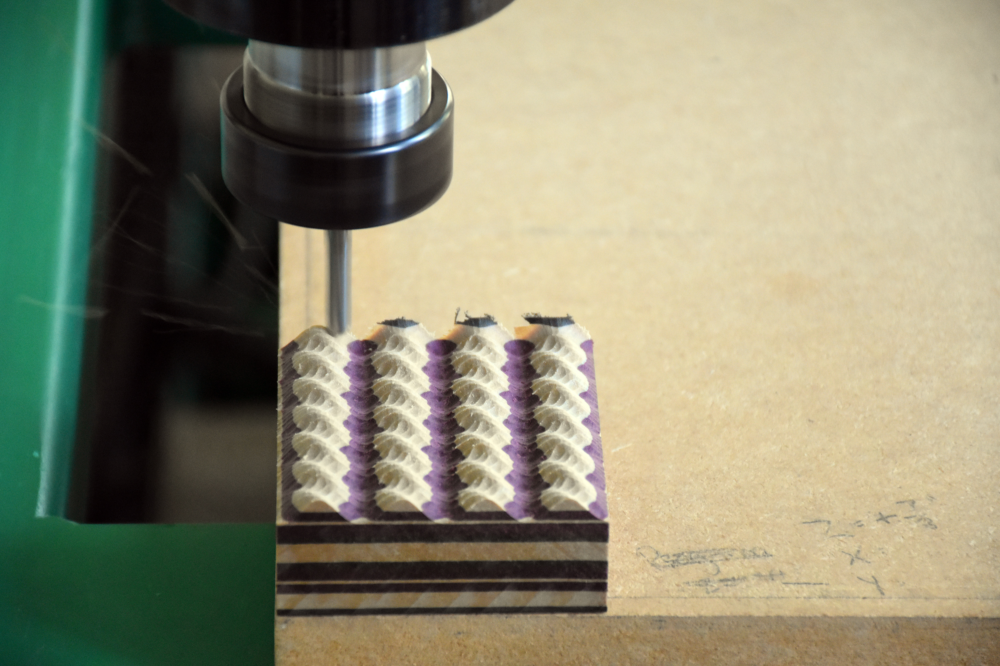
</p>
