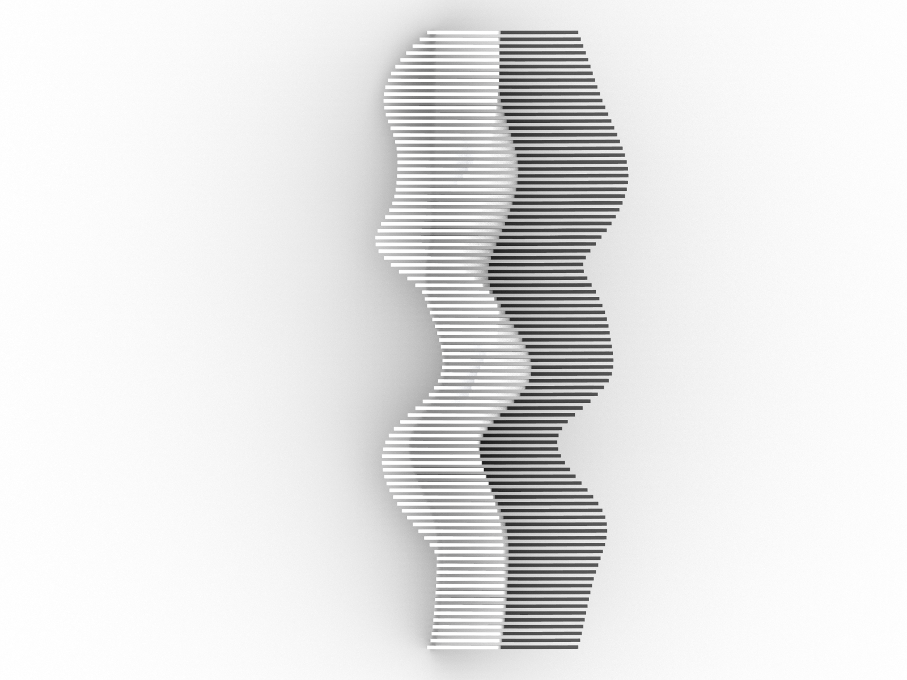
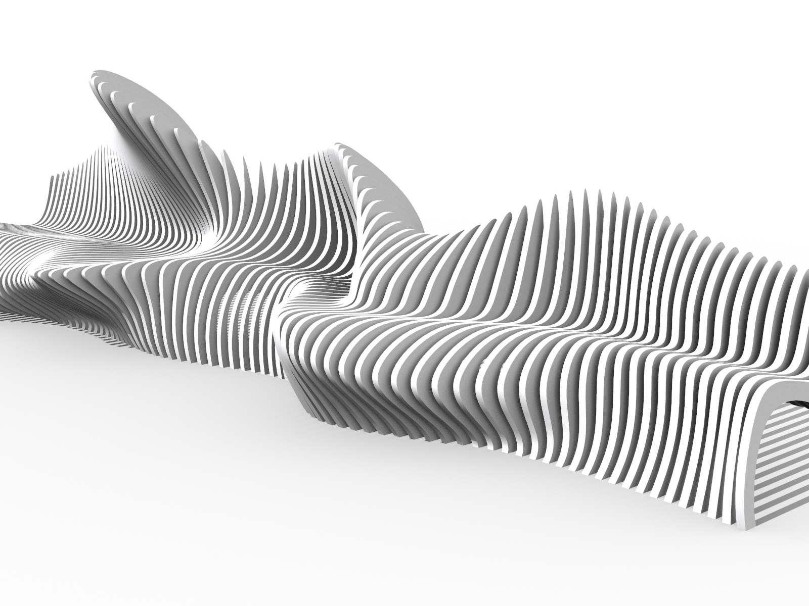
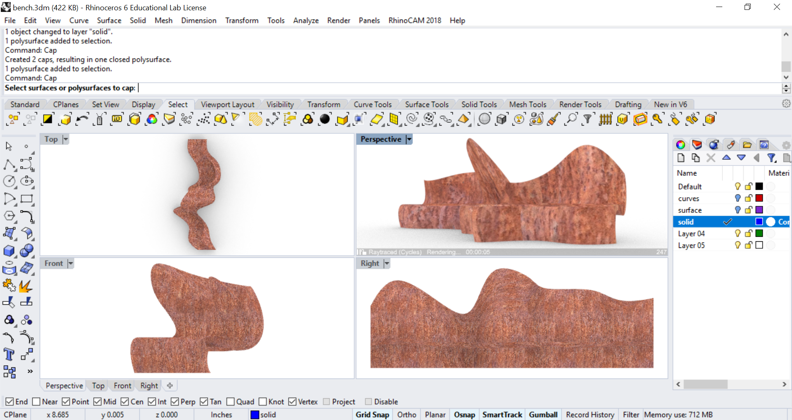

# Contents
1. [**Freeform modeling**](#freeform-modeling)

---

# Freeform modeling
Model a freeform bench and
explore different modes of fabrication
such as casting or cnc milling plywood slices.
Use the Rhino file [freeform_bench.3dm](../models/freeform_bench.3dm)
as a reference.

<p align="center">


</p>

---

## ...
...
```
_InterpCrv

_Array

History

_Loft
```

<p align="center">

</p>

```
_Contour
_ExtrudeCrv
_Cap

```

<p align="center">


</p>

---

Save your work.
```
_SaveAs
```


by drawing a series of profile curves,
lofting the curves to generate a surface


Curve: Interpolate points

```
_InterpCrv

_Array

History

_Loft


_Contour


_ExtrudeCrv


_Cap


Materials

Renderings

```

**Fabrication**
