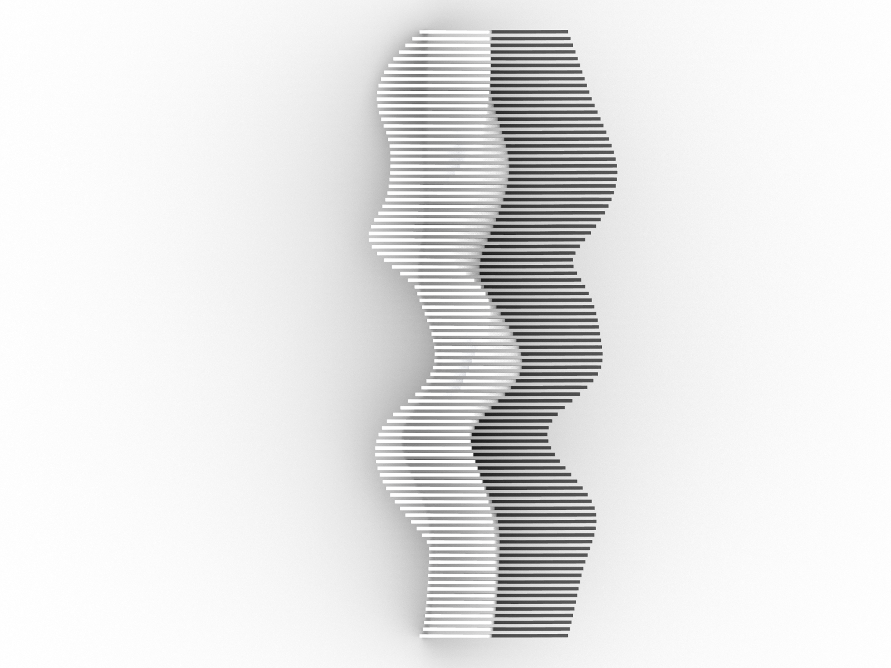
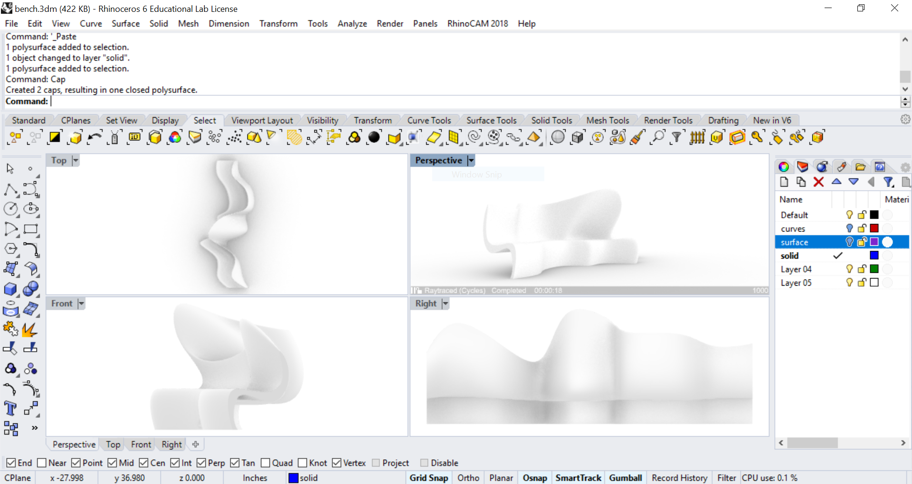
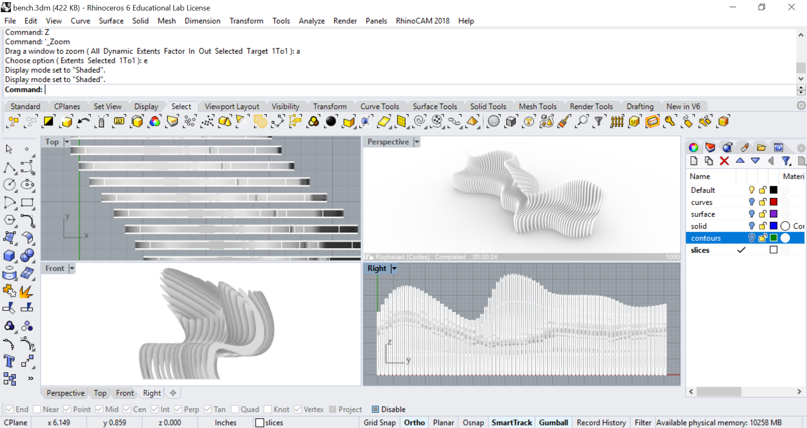
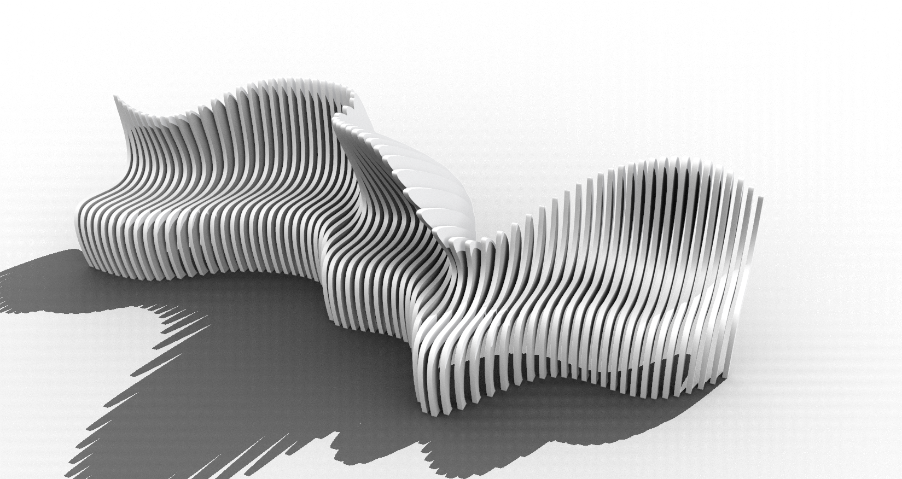
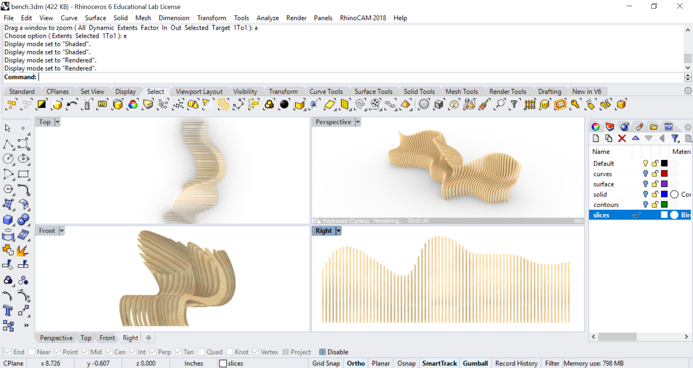

# Contents
1. [**Freeform modeling**](#freeform-modeling)
    1. [Sculpting](#sculpting)
    2. [Slicing](#slicing)
    3. [Fabrication](#fabrication)
---

# Freeform modeling
Model a freeform bench and
explore different modes of fabrication
such as casting concrete or CNC milling plywood slices.
Use the Rhino file [freeform_bench.3dm](../models/freeform_bench.3dm)
as a reference.

<p align="center">


</p>

---

## Sculpting
Draw a profile curve and
array this curve along the Y-axis.
Then turn on history and
then loft the curves to interpolate a surface for the bench.
With history on, you will be able to sculpt the lofted surface
by reshaping the curves.
Turn on control points and
reshape the curves by moving the control points with the gumball.
When you are finished modeling the surface,
turn off control points and
cap the surface to make it a solid.
```
InterpCrv
Array
History
Loft
Cap
```

<p align="center">

</p>

---

## Slicing
Divide the bench into slices for fabrication with CNC-milled plywood.
Use the contour command to compute profiles along the Y-axis.
Set the contour interval to twice the thickness of the plywood.
Then extrude these curves as a solids along the Y-axis.
Set the extrusion distance to the thickness of the plywood.
```
_Contour
_ExtrudeCrv
_Cap
```

<p align="center">


</p>

Save your work.
```
_SaveAs
```

---

## Fabrication
As a prototype laser cut a scale model of the bench
in basswood, balsa wood, museum board, or chipboard.
Then CNC mill the slices in plywood and build a full scale prototype.


