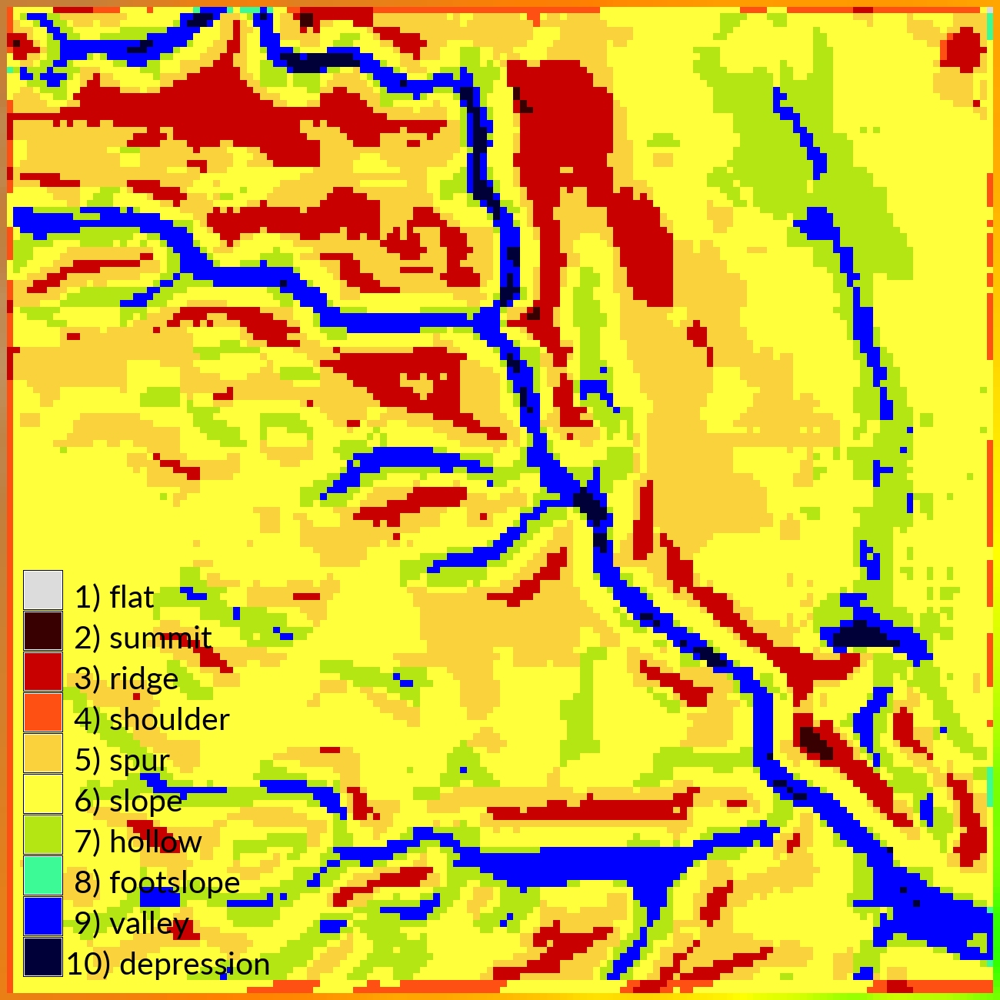

# Contents
1. [**Landform classification**](#landform-classification.md)
    1. [Geomorphons](#geomorphons)
    2. [Topographic parameters](#topographic-parameters)

---

### Geomorphons
Start GRASS GIS in the `nc_spm_evolution` location
and open the `terrain_analysis` mapset.
Set your region to the study area
with 1 meter resolution
using the module
[g.region](https://grass.osgeo.org/grass74/manuals/g.region.html).
Specify the saved region `region`.
```
g.region region=region res=1
```

Identify the landforms in our study area using
a machine vision approach based on visibility
with the add-on module
[r.geomorphon](https://grass.osgeo.org/grass74/manuals/addons/r.geomorphon.html).
First call
[g.extension](https://grass.osgeo.org/grass74/manuals/g.extension.html)
to install the add-on.
Then run `r.geomorphon` to compute basic landforms.
Experiment with the
`search`, `skip`, and `flat` parameters.
```
g.extension extension=r.geomorphon
r.geomorphon elevation=elevation_2016 forms=forms_2016 search=12
r.geomorphon elevation=elevation_2016 forms=forms search=24 skip=0 flat=1 dist=0 --overwrite
```

<p align="center">
  
</p>

The landform types are:
**1.** flat, **2.** summit, **3.** ridge, **4.** shoulder, **5.** spur,
**6.** slope, **7.** hollow, **8.** footslope, **9.** valley,
and **10.** depression.

<p align="center"></p>

---

### Topographic parameters
Use a calculus based approach to calculate topographic parameters
with the module
[r.param.scale](https://grass.osgeo.org/grass74/manuals/r.param.scale.html).
Set `method=feature` to classify basic landforms
In the `size` parameter set the moving window search size to a multiple of 3.
```
r.param.scale in=elevation_2016 output=morphology method=feature size=9
```
