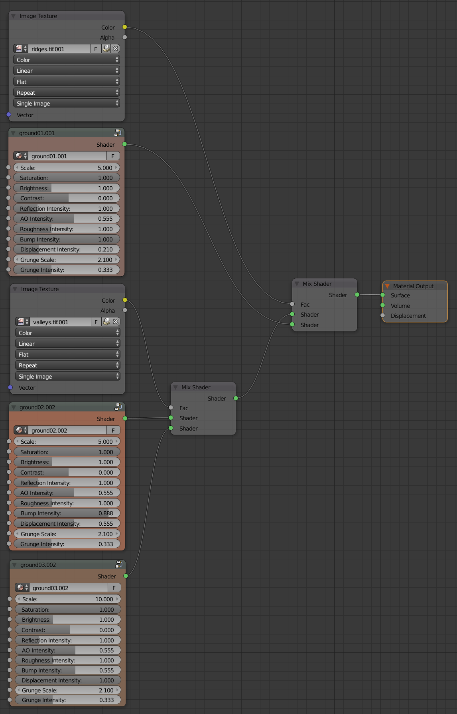
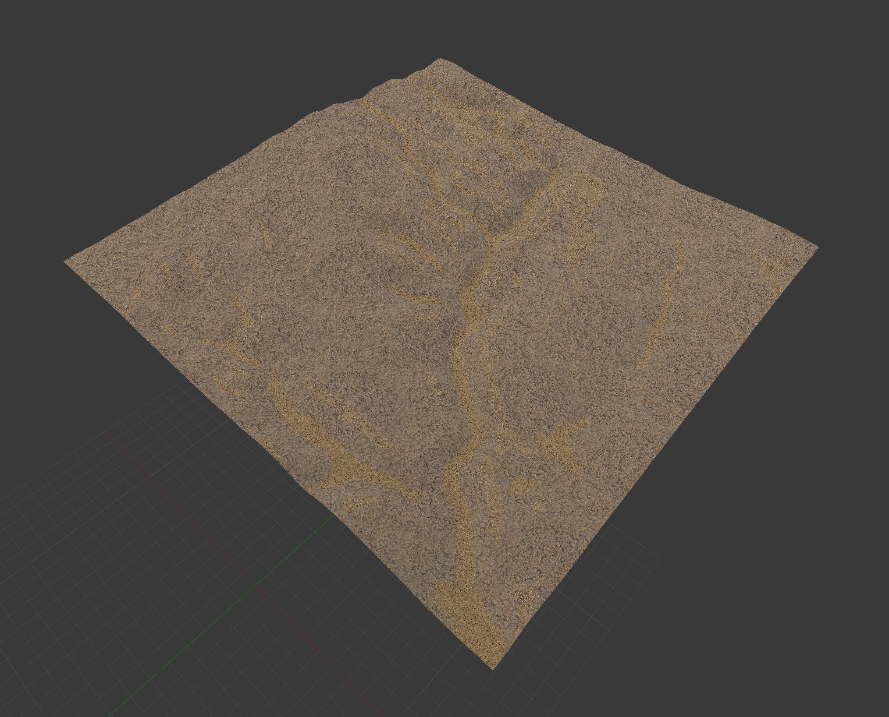

# Contents
1. [**Landscape modeling**](#landscape-modeling)
    1. [Export geospatial data](#export-geospatial-data)
    2. [Export terrain data](#export-terrain-data)
    3. [Export imagery](#export-imagery)
    4. [Export landform data](#export-landform-data)
    5. [Print region](#print-region)
    6. [3D terrain](#3d-terrain)
    7. [Importing geospatial data into Blender](#importing-geospatial-data-into-blender)
    8. [Simple ground texture](#simple-ground-texture)
    9. [Ground texture from landforms](#ground-texture-from-landforms)

# Landscape modeling

## Export geospatial data
Start GRASS GIS in the `nc_spm_evolution` location
and open the `PERMANENT` mapset.

### Export terrain data
Set a new region for a smaller study area
using the module
[g.region](https://grass.osgeo.org/grass72/manuals/g.region.html).
Use map algebra with
[r.mapcalc](https://grass.osgeo.org/grass72/manuals/r.mapcalc.html)
to create a cropped version of the elevation map.
Export this cropped digital elevation model as a GeoTIFF using
[r.out.gdal](https://grass.osgeo.org/grass72/manuals/r.out.gdal.html).
```
g.region n=150862 s=150712 w=597290 e=597440 save=subregion res=1
r.mapcalc expression="elevation = elevation_2016"
r.out.gdal input=elevation output=elevation.tif format=GTiff
```

### Export imagery
Set your region to our smaller, detailed study area
with 1 meter resolution using the module
[g.region](https://grass.osgeo.org/grass72/manuals/g.region.html).
Specify the saved region `subregion`.
Use map algebra with
[r.mapcalc](https://grass.osgeo.org/grass72/manuals/r.mapcalc.html)
to create separate maps of bare ground, mixed forest, and grass.
Then export these landcover maps as GeoTIFFs using
[r.out.gdal](https://grass.osgeo.org/grass72/manuals/r.out.gdal.html).
You will use these landcover maps to generate particle systems of 3D plants.
```
r.mapcalc expression="bare_ground = if(landcover==31,1,0)"
r.colors map=bare_ground color=grey
r.mapcalc expression="mixed_forest = if(landcover==43,1,0)"
r.colors map=mixed_forest color=grey
r.mapcalc expression="grass = if(landcover==71,1,0)"
r.colors map=grass color=grey
```

### Export landform data
Change the mapset to `terrain_analysis` using
[g.mapset](https://grass.osgeo.org/grass72/manuals/g.mapset.html).
Set your region to our smaller, detailed study area
with 1 meter resolution using the module
[g.region](https://grass.osgeo.org/grass72/manuals/g.region.html).
Specify the saved region `subregion`.
Use the map algebra with the raster map calculator
[r.mapcalc](https://grass.osgeo.org/grass72/manuals/r.mapcalc.html)
to create maps of similar landforms typologies.
Export these as GeoTIFFs using
[r.out.gdal](https://grass.osgeo.org/grass72/manuals/r.out.gdal.html).
You will use these landform maps to map earth and ground cover textures.
```
g.mapset mapset=terrain_analysis
g.region region=subregion res=1
r.mapcalc expression="landforms = landforms_2016"
r.mapcalc expression="ridges = if(landforms==8 ||| landforms==9 ||| landforms==10,1,0)"
r.colors map=valleys color=grey
r.mapcalc expression="ridges = if(landforms==2 ||| landforms==3 ||| landforms==4,1,0)" --overwrite
r.colors map=ridges color=grey
r.mapcalc expression="slopes = if(landforms==6,1,0)" --overwrite
r.colors map=slopes color=grey
```

### Print region
Run g.region with the `p` flag to print the boundaries.
Copy the `south` and `west` boundary values.
You will use these to set your origin of your scene in Blender.
```
g.region -p  
```
The output will be:
```
projection: 99 (NAD83(HARN) / North Carolina)
zone:       0
datum:      nad83harn
ellipsoid:  grs80
north:      150870
south:      150720
west:       597290
east:       597440
nsres:      1
ewres:      1
rows:       150
cols:       150
cells:      22500
```

## 3D terrain

### Importing geospatial data into Blender
Download the
[zip archive](https://github.com/domlysz/BlenderGIS/archive/master.zip)
for the
[BlenderGIS add-on](https://github.com/domlysz/BlenderGIS).
See its [wiki](https://github.com/domlysz/BlenderGIS/wiki)
for detailed instructions about installing and using the add-on.

Launch Blender.
Set the renderer to `Cycles Render`.
In the `File` menu open `User Preferences` (Ctrl + Alt + U).
In the `Add-ons` tab click `Install from File...`
and select `BlenderGIS-master.zip`.
Check and then expand `3D View: BlenderGIS`.
Set the BlenderGIS' `Spatial Reference Systems`
to North Carolina State Plane Meters
by clicking `Add` and then setting the EPSG code with
`Definition: 3358`,
`Description: NAD83(HARN) / North Carolina`,
and checking `Save to addon preferences`.
Then click `Ok`.
Select the new `NAD83(HARN) / North Carolina` spatial reference system.
Click `Save User Settings`
and close the User Preferences dialog.

*Nota bene:* you can search for EPSG codes on the web at either
[epsg.io](epsg.io)
or [http://spatialreference.org/](http://spatialreference.org/).
Try searching either site for `North Carolina` then select
the result with the North American Datum of 1983 (NAD83)
and North Carolina State Plane
(High Accuracy Reference Network) with meters as the unit.
The EPSG code will be `3358`.

In Blender set the 3D viewport to `Top Ortho`.
First set `Ortho` by pressing `5` on the numeric keypad
then set `Top` by pressing `7` on the numeric keypad.
*Nota bene:* [numeric keypad hotkeys](https://en.wikibooks.org/wiki/Blender_3D:_HotKeys/3D_View/Object_Mode)

Delete the default cube.

Open the `GIS` tab added by Blender GIS.
First set your spatial reference system
Under `Geoscene` click the

`Switch scene crs` button
and select `NAD83 / North Carolina`
from the dropdown menu and press `Ok`.
Then set the `scene origin coordinates` to `Proj` and
set `crs x: 597290` and `crs y: 150720`
to match the west and south boundaries determined in GRASS GIS.

Import `elevation.tif` into Blender using
`File > Import > Georeferenced raster`
or the

`Import georeferenced raster with world file` button in the GIS tab.
Select `elevation.tif`. then in the `Import georaster` panel
set `Mode: As DEM`,
set `Subdivision: Mesh`
and finally click `Import georaster`.
See the BlenderGIS
[wiki](https://github.com/domlysz/BlenderGIS/wiki/Import-georef-raster).
for more details about importing georeferenced rasters.

To vertically exaggerate the digital elevation model
select `elevation` in the Outliner,
and open the

`Modifiers` panel.
This will show the parameters for the
[displace](https://docs.blender.org/manual/en/dev/modeling/modifiers/deform/displace.html)
modifier used to generate a mesh from the raster values.
Set `Strength: 2.0`
to vertically exaggerate by a factor of 2.
Click `Apply` to make this displace modifier permanent.

Create a base for the terrain
by copying and pasting the `elevation` mesh.
Make sure that the displacement modifier has been applied
or you will get an error in following steps.
Select this new copy.
Rename it `base`.
Enter edit mode with `tab`.
Extrude Region with `e `
then type `-25` to extrude -50 meter vertically.
Scale with `s`, type `z` to constrain to the z-axis,
and type `0` to flatten the base.
Press `tab` to return to object mode.

Use a sun to light the scene.
Select `Lamp` in the Outliner
and open the

`Data` panel.
Set `Lamp` to `Sun`.
Move the sun 1000 units vertically.

Save your scene as `nspm_evolution.blend` (Shift + Ctrl + S).

### Simple ground texture
Select our terrain mesh `elevation` in the Outliner.
In the 
`Material` panel
open the `Cycles Material Vault`,
click on `Category Type`,
select `Ground`,
browse to select `Ground01`,
and click `Assign Material`.
Then in the `Surface` tab of the `Material` panel
set `Scale: 10`.

Save your scene (Ctrl + S).

### Ground texture from landforms
*Under development...*



