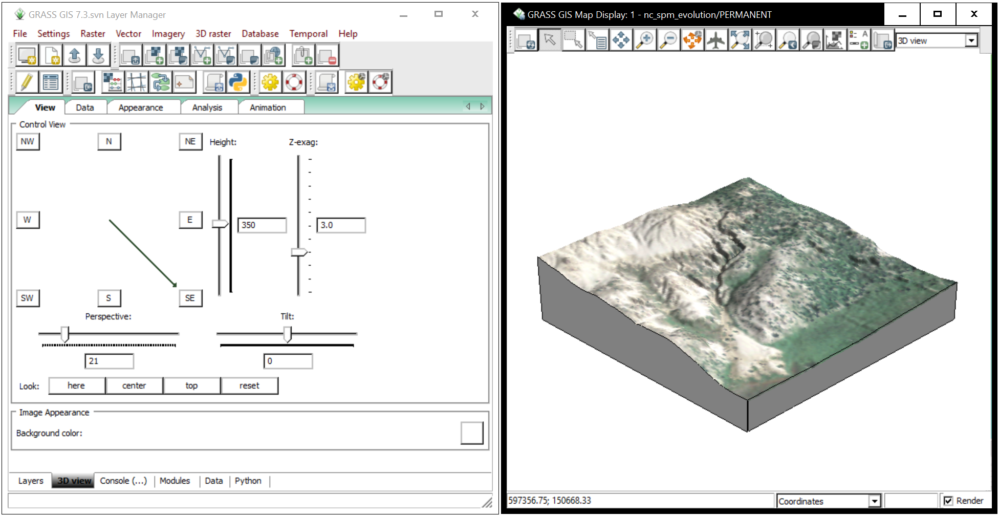

# Contents
1. [**Terrain modeling**](#terrain-modeling)
    1. [Elevation data sources](#elevation-data-sources)
        1. [Data acquisition in GRASS](#data-acquisition-in-grass)
    1. [Topographic analysis in ArcGIS](#topographic-analysis-in-arcgis)
        1. [Contours](#contours)
        1. [Slope and aspect](#slope-and-aspect)
        1. [Shaded relief](#shaded-relief)
        1. [Visual programming](#visual-programming)
    1. [Topographic analysis in GRASS](#topographic-analysis-in-grass)
        1. [Color tables](#color-tables)
        1. [Contours](#contours)
        1. [Slope and aspect](#slope-and-aspect)
        1. [Shaded relief](#shaded-relief)
        1. [Skyview factor](#skyview-factor)
        1. [Visual programming](#visual-programming)
        1. [Profile](#profile)
        1. [Time series analysis](#time-series-analysis)
    1. [3D terrain visualization in GRASS](#3d-terrain-visualization-in-grass)
    1. [3D terrain modeling in Rhino](#3d-terrain-modeling-in-rhino)
        1. [Heightfield](#heightfield)
        1. [Heightfield mesh](#heightfield-mesh)
        1. [Point cloud patching](#point-cloud-patching)
        1. [Material and texture mapping](#material-and-texture-mapping)
        1. [Delaunay triangulation](#delaunay-triangulation)

---

# Terrain modeling
In this section you will model, analyze and visualize topography
in GRASS GIS, ArcGIS, and Rhino.

---

## Elevation data sources
* [National Map Viewer](http://nationalmap.gov/viewer.html)
* [US Interagency Elevation Inventory](https://coast.noaa.gov/inventory/)
* [Open Topography](http://www.opentopography.org/)
* [NC Spatial Data Download](https://sdd.nc.gov/sdd/)

---

### Data acquisition in GRASS
Download, import, and re-project data from the USGS National Map
directly into GRASS GIS using the add-on module
[r.in.usgs](https://grass.osgeo.org/grass74/manuals/addons/r.in.usgs.html).

Start GRASS GIS in the `nc_spm_evolution` location
and create a new mapset called `data_acquisition`.
Set your region to our study area with 1 meter resolution
using the module
[g.region](https://grass.osgeo.org/grass74/manuals/g.region.html)
by specifying the boundaries.
```
g.region n=151030 s=150580 w=597195 e=597645 res=1
```

Use the add-on module
[r.in.usgs](https://grass.osgeo.org/grass74/manuals/addons/r.in.usgs.html)
to import a topographic map from the National Elevation Dataset (NED)
at 1/9 arcsecond or approximately 3.4 meter resolution,
orthophotography from the National Agriculture Imagery Program (NAIP)
at 1 meter resolution,
and a landcover map at 30 meter resolution.
```
r.in.usgs product=ned output_name=elevation_30m output_directory=usgs ned_dataset=ned19sec resampling_method=bilinear
r.in.usgs product=naip output_name=imagery_1m output_directory=usgs resampling_method=nearest
r.in.usgs product=nlcd output_name=landcover_2011 output_directory=usgs nlcd_dataset=nlcd2011 nlcd_subset=landcover resampling_method=nearest
```

---

## Topographic analysis in ArcGIS
*Under development...*

### Contours
*Under development...*

### Slope and aspect
*Under development...*

### Shaded relief
*Under development...*

### Visual programming
*Under development...*

---

## Topographic analysis in GRASS
Start GRASS GIS in the `nc_spm_evolution` location
and create a new mapset called `terrain_analysis`.

**Region**
Set your region to our study area with 1 meter resolution
using the module
[g.region](https://grass.osgeo.org/grass74/manuals/g.region.html)
by specifying the boundaries, a saved region, or a reference raster map.
```
g.region n=151030 s=150580 w=597195 e=597645 save=region res=1
g.region region=region res=1
g.region raster=elevation_2016 res=1
```

---

### Color tables
Test different colors tables to find the best way to represent the topography.
GRASS GIS has a topographic color table called `elevation`.
Use the module [r.colors](https://grass.osgeo.org/grass74/manuals/r.colors.html)
to apply this color.
Use the `e` flag for histogram equalization.
```
r.colors map=elevation_2016 color=elevation -e
```

Try the beautiful perceptually uniform sequential color table *viridis* using the module [r.colors](https://grass.osgeo.org/grass74/manuals/r.colors.html).
```
r.colors map=elevation_2016 color=viridis
```

Try more
[perceptually uniform sequential color tables](http://soliton.vm.bytemark.co.uk/pub/cpt-city/mpl/index.html)
using the extension
[r.cpt2grass](https://grass.osgeo.org/grass74/manuals/addons/r.cpt2grass.html).
```
g.extension extension=r.cpt2grass
r.cpt2grass map=elevation_2016 url=http://soliton.vm.bytemark.co.uk/pub/cpt-city/mpl/inferno.cpt -s
```

Also experiment with the collection of
[http://soliton.vm.bytemark.co.uk/pub/cpt-city/views/topo.html](topographic color tables)
hosted by the [cpt-city](http://soliton.vm.bytemark.co.uk/pub/cpt-city/) repository
using the extension
[r.cpt2grass](https://grass.osgeo.org/grass74/manuals/addons/r.cpt2grass.html).
```
g.extension extension=r.cpt2grass
r.cpt2grass map=elevation_2016 url=http://soliton.vm.bytemark.co.uk/pub/cpt-city/wkp/schwarzwald/wiki-schwarzwald-cont.cpt -s
```

---

### Contours
Compute contours from the digital elevation model using the module
[r.contour](https://grass.osgeo.org/grass74/manuals/r.contour.html)
with a 1 meter contour interval set with option `step=1`.
Then compute 5 meter contours using the option `step=5`.
Double click on the 5 meter contour map in the layer manager,
switch to the line tab,
and make the line weight heavier (eg. 2 or 3 px).
```
r.contour input=elevation_2016 output=contour_1m_2016 step=1
r.contour input=elevation_2016 output=contour_5m_2016 step=5
```

---

### Slope and aspect
Compute the slope and aspect of our study area's topography
using the module
[r.slope.aspect](https://grass.osgeo.org/grass74/manuals/r.slope.aspect.html).
This module can calculate topographic parameters including
slope, aspect, tangential and profile curvature,
and partial derivatives from an elevation raster.
```
r.slope.aspect elevation=elevation_2016 slope=slope_2016 aspect=aspect_2016
```

---

### Shaded relief
Compute a relief map for our study area's topography using the module
[r.relief](https://grass.osgeo.org/grass74/manuals/r.relief.html).
Optionally choose to vertically exaggerate the relief
with the parameter `zscale`.
You can also change the `altitude` or `azimuth` parameters
to explore different lighting conditions.
Then use [r.shade](https://grass.osgeo.org/grass74/manuals/r.shade.html)
to create a composite of elevation and relief maps
for the sake of visualization.
Adjust the brightness with the `brighten` parameter until it looks good.
```
r.relief input=elevation_2016 output=relief_2016 zscale=3
r.shade shade=relief_2016 color=elevation_2016 output=shaded_relief_2016 brighten=30
```
In the layer manager turn off all layers except
the shaded relief and the contours.
Move the contour maps above the shaded relief map.

---

### Skyview factor
*Under development...*

---

### Visual programming
*Under development...*

---

### Profile
Use the

GUI profile surface map button
to find the profile, i.e. section, of the digital elevation model.

---

### Time series analysis
Compare a time series of elevation maps using
map algebra with
[r.mapcalc](https://grass.osgeo.org/grass74/manuals/r.mapcalc.html)
and raster statistics with
[r.series](https://grass.osgeo.org/grass74/manuals/r.series.html).
Use `r.mapcalc` to calculate the difference in elevation,
ie. the net change in elevation, between 2004 and 2016.
Use [r.colors](https://grass.osgeo.org/grass74/manuals/r.colors.html)
to set an appropriate color table like the built-in `differences` color table
or a custom rules file like the `color_difference.txt`
included in the nc_spm_evolution location.
```
r.mapcalc "difference_2004_2016 = elevation_2016 - elevation_2004"
r.colors map=difference_2004_2016 color=differences
r.colors map=difference_2004_2016 rules=color_difference.txt
```

Calculate the range of the time series of elevation maps
using the module
[r.series](https://grass.osgeo.org/grass74/manuals/r.series.html).
```
r.series input=elevation2004,elevation_2012,elevation_2016 output=range_2004_2016 method=range
```

---

## 3D terrain visualization in GRASS
Start GRASS GIS in the `nc_spm_evolution` location
and select the `terrain_analysis` mapset.

Set your region to our study area with 1 meter resolution
using the module
[g.region](https://grass.osgeo.org/grass74/manuals/g.region.html)
by specifying a reference raster map.
```
g.region raster=elevation_2016 res=1
```

Add the `elevation_2016` raster map layer to your map.

Change the map display mode from `2D` to `3D` view.
The map display will switch to 3D view
and the layer manager will switch to the `3D view` tab.
In the 3D view tab switch to `Data` tab.
Set the `Raster map` box to `elevation_2016`.
In the `Draw` box set `Fine mode: resolution` to `1`.
In the `Surface attributes` box set `Color` to
the elevation map `elevation_2016`,
the orthophoto `naip_2014`,
or another map of your choice.
This color map will be draped over the elevation surface.
In the `View` tab set `Z-exag` to `3`
to vertically exaggerate the elevation by a factor of 3.
In the `View` tab also
set the `Control view` to `SE`
and set the `Height` to `350`.
In the `Appearance` tab
expand the `Fringe` dropdown menu,
then in the `Edge with fringe` box check `S & E`
and in the `Settings` box set the
`elevation of the fringe from bottom` to `80`.
Experiment with different light source positions
in the `Lighting` menu in the `Appearance` tab.

Export your 3D view with the
`Save display to graphic file`

button.
<p align="center"></p>

---

## 3D terrain modeling in Rhino
In this section you will export
a digital elevation model from GRASS GIS
and import it into Rhino for 3D modeling and visualization.

---

### Heightfield
Start GRASS GIS in the `nc_spm_evolution` location
and select the `terrain_analysis` mapset.

Set your region to our study area with 3 meter resolution
using the module
[g.region](https://grass.osgeo.org/grass74/manuals/g.region.html)
by specifying a reference raster map.
```
g.region raster=elevation_2016 res=3
```

Round the 2016 elevation raster map
from floating point values to integers
using the raster map calculator
[r.mapcalc](https://grass.osgeo.org/grass74/manuals/r.mapcalc.html).
```
r.mapcalc expression="integer_elevation_2016 = round(elevation_2016)"
```

Export `integer_elevation_2016` to `.png` with
[r.out.gdal](https://grass.osgeo.org/grass74/manuals/r.out.gdal.html).
```
r.out.gdal input=integer_elevation_2016@terrain_analysis output=elevation_2016.png format=PNG
```

Start Rhino5.

Open the template `Large Objects - Meters.3dm`.

Create a layer called `region` and make it the current layer.

Turn on `Grid Snap` and `Ortho`.
Create a 450m x 450m rectangle the size of our study landscape
with the corner-to-corner
[Rectangle](http://docs.mcneel.com/rhino/5/help/en-us/commands/rectangle.htm)
command.
```
_Rectangle
First corner of rectangle: 0,0
Other corner or length: 450,450
```

Create a layer called `surface` and make it the current layer.

Run the command [Heightfield from Image](http://docs.mcneel.com/rhino/5/help/en-us/commands/heightfield.htm).
Open bitmap `elevation.png`.
Use the 450m x 450m rectangle to define
the first and second corners of the heightfield.
Set `Number of sample points: 30 x 30`,
set `Height: 113 meters`,
check `Set image as texture`,
and select `Create object by: Surface from control points at sample locations`.
```
_Heightfield
First Corner: 0,0
Second corner or length: 450
```

Create contours with the [Contour](http://docs.mcneel.com/rhino/5/help/en-us/commands/contour.htm) command.
```
_Contour
Select objects for contours
_Enter
Contour plane base point: 0,0,0
Direction perpendicular to contour planes: 0,0,1
Distance between contours: 1.00
_Enter
```

Save as `heightfield.3dm`.
```
_SaveAs
```

---

### Heightfield mesh
In Rhino 5 open `heightfield.3dm`

Turn off the `surface` layer.
Create a layer called `mesh`
and make it the current layer.

Run the command [Heightfield from Image](http://docs.mcneel.com/rhino/5/help/en-us/commands/heightfield.htm).
Open bitmap `elevation.png`.
Use the 450m x 450m rectangle to define
the first and second corners of the heightfield.
Set `Number of sample points: 150 x 150`,
set `Height: 113 meters`,
check `Set image as texture`,
and select `Create object by: Mesh with vertices at sample locations`.
```
_Heightfield
First Corner: 0,0
Second corner or length: 450
```

Save `heightfield.3dm`.
```
_Save
```

---

### Point cloud patching
Start GRASS GIS in the `nc_spm_evolution` location
and select the `terrain_analysis` mapset.

Set your region to our study area with 3 meter resolution
using the module
[g.region](https://grass.osgeo.org/grass74/manuals/g.region.html)
by specifying a reference raster map.
Export `elevation_2016` as a comma delimited xyz point cloud.
```
g.region raster=elevation_2016 res=3
r.out.xyz input=elevation_2016 output=D:\rhino\elevation_3m.xyz separator=comma
```

Start Rhino5.

Open the template `Large Objects - Meters.3dm`.

Create a layer called `point_cloud` and make it the current layer.

Import the comma-delimited 3m resolution xyz point cloud.
For `Delimiters` select comma. Check `Create point cloud`.
Then zoom all viewports to the extent of the data.
```
_Import
Zoom
All
Extents
```

Use the
[Scale1D](http://docs.mcneel.com/rhino/5/help/en-us/commands/scale1d.htm)
command to vertically exaggerate your elevation data by a factor of 3.
```
Scale1D
Origin point: 0,0,0
Scale factor: 3
Scale direction: 0,0,1
```

Create a layer called `plane` and make it the current layer.

Create a corner to corner rectangular plane
with the [Plane](http://docs.mcneel.com/rhino/5/help/en-us/commands/plane.htm)
command.
Designate opposite corners of the point cloud.
Then use the Gumball to move the plane beneath the lowest point.
```
_Plane
```

Create a layer called `surface` and make it the current layer.

Use the [Patch](http://docs.mcneel.com/rhino/5/help/en-us/commands/patch.htm)
command to create a NURBS surface.
Set `Sample point spacing` to `1.0`,
set `Surface U spans` to `150`,
set `Surface V spans` to `150`,
and set the `Starting surface` to the plane.
```
Patch
```

Hide or delete the point cloud layer.

Set all viewports to `Rendered` mode.

Make the plane larger with the
[Scale2D](http://docs.mcneel.com/rhino/5/help/en-us/commands/scale2d.htm)
command
```
Command: Scale2D
Origin point
Scale factor: 1.25
```

Create a layer called `solid` and make it the current layer.

Use the
[Extrude surface to boundary](http://docs.mcneel.com/rhino/5/help/en-us/commands/extrudesrf.htm)
command to extrude the topographic NURBS surface to the plane
to create a solid model with a base.
Select the plane as the boundary surface.
```
_ExtrudeSrf
_Solid=_Yes
_ToBoundary
Select a boundary surface
```

Hide or delete the plane layer.

Save as `nc_spm_evolution_3m.3dm`.
```
_SaveAs
```

---

### Material and texture mapping
Start GRASS GIS in the `nc_spm_evolution` location
and select the `PERMANENT` mapset.


Add the raster map layer `naip_2014` with the latest orthophoto
to your map display. Resize your map display so that is square and
zoom to the selected map.
Export this map with the
`Save display to graphic file`

button. Save as `naip_2014.png`.


Start Rhino5 and open `nc_spm_evolution_3m.3dm`.

Select the polysurface model of the topography.
In the `properties` tab click the `material` button.
Set `Assign material by:` to `Object`.
In the `Textures` section
set `Color` to the file `naip_2014.png`
Click the `Texture mapping` button and
set `Type` to `Planar (UVW)`.
Optionally turn on the sun with the command `sun`.
```
_SaveAs
```

---

### Delaunay triangulation

Start GRASS GIS in the `nc_spm_evolution` location
and select the `terrain_analysis` mapset.

Set your region to our study area with 1 meter resolution
using the module
[g.region](https://grass.osgeo.org/grass74/manuals/g.region.html)
by specifying a reference raster map.
Export `elevation_2016` as a georeferenced tif image (GeoTIFF).
```
g.region raster=elevation_2016 res=1
r.out.gdal input=elevation_2016 output=elevation_2016.tif format=GTiff
```

Start Rhino5.

Open the template `Large Objects - Meters.3dm`.

Create a layer called `point_cloud` and make it the current layer.

Use the RhinoTerrain plugin to import
the elevation geotif raster as a point cloud.
Alternatively you could import an xyz point cloud or a .las file.
Run the RhinoTerrain command `Import elevation raster file`,
select `elevation_2016.tif`,
for `Choose target coordinate system` select `Use input data coordinate system`,
for `Output type` select `Point cloud`.
```
RtImportElevation
```

Use the
[Scale1D](http://docs.mcneel.com/rhino/5/help/en-us/commands/scale1d.htm)
command to vertically exaggerate your elevation data by a factor of 3.
```
Scale1D
Origin point: 0,0,0
Scale factor: 3
Scale direction: 0,0,1
```

Create a layer called `mesh` and make it the current layer.

Create a triangulated mesh using the RhinoTerrain command `Create Terrain Mesh`.
Select the point cloud when prompted `Select objects for triangulation`.
Accept the previewed result.
```
RtMeshTerrainCreate
_Accept
```

Turn off or delete the `point_cloud` layer.
Set viewports to `Rendered` mode.

Create a 50m base for the terrain model
using the RhinoTerrain command `Create Terrain Base`
```
RtMeshTerrainBase
Select mesh (BaseHeightStyle=Relative  BaseHeight=50)
_Enter
```

Optionally use the RhinoTerrain `Create contour curves` command
to compute contours.  
```
RtCartographyContoursCurvesCreate
Select mesh
_Enter
Select mesh (FirstInterval=1  SecondInterval=10  ThirdInterval=0  FourthInterval=0  ContourSmoothness=0  Complete)
_Complete
```

Turn on the `Sun`,
set `Date and time` to `Now`,
and set `Location` to `Here`.
```
Sun
```

Save as `rhinoterrain.3dm`
```
_SaveAs
```
